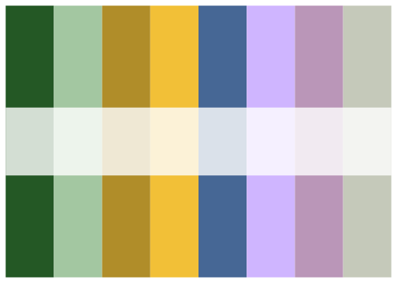
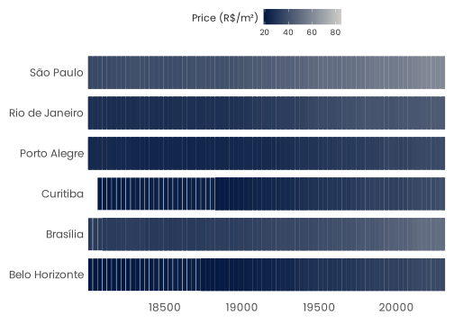
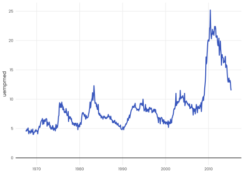
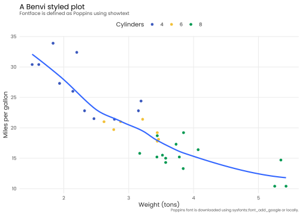

<!-- README.md is generated from README.Rmd. Please edit that file -->

# benviplot

<!-- badges: start -->

[](https://github.com/viniciusoike/benviplot/actions)
[](https://app.codecov.io/gh/viniciusoike/benviplot?branch=master)
[](https://github.com/viniciusoike/benviplot/actions)
[](https://opensource.org/licenses/MIT)
[](https://lifecycle.r-lib.org/articles/stages.html#stable)
<!-- badges: end -->

> **DISCLAIMER**: This is an unofficial, independent project created by
> Vinicius Oike and is **NOT** affiliated with, endorsed by, or
> connected to QuintoAndar in any way. Benvi was a former brand of
> QuintoAndar that was discontinued in 2024. This package uses publicly
> available color schemes from that period for data visualization
> purposes. See [DISCLAIMER.md](DISCLAIMER.md) for details.

## Overview

`benviplot` provides color palettes and ggplot2 extensions for creating
quality graphics. The package includes:

- **Color Palettes**: Curated color schemes (Set, Qualitative,
  Sequential palettes)
- **ggplot2 Scales**: Discrete and continuous scales for seamless
  ggplot2 integration
- **Plot Helpers**: Wrapper functions for common visualizations
- **Custom Theme**: Clean, professional theme with Poppins font support

## Installation

You can install benviplot from GitHub:

``` r
# Install remotes if needed
# install.packages("remotes")

# Install benviplot from GitHub
remotes::install_github("viniciusoike/benviplot")
```

## Usage

Load the package along with ggplot2:

``` r
library(ggplot2)
library(benviplot)
```

## Color palettes

Color palettes can be visualized using `benvi_palette`.

``` r
benvi_palette("rio_qual")
```



``` r
benvi_palette("Qual2")
```


Although the console prints a palette the hex values can be used
directly.

``` r
as.character(benvi_palette("Qual2"))
#> [1] "#C5C9BA" "#816242" "#F2C037" "#009850" "#466795" "#9A75B4" "#EA4E58"
#> [8] "#C64729"
```

## Plotting

To use the colors in plots use one of the `scale_*_benvi_*` functions:

- `scale_color_benvi_d`
- `scale_color_benvi_c`
- `scale_fill_benvi_c`
- `scale_fill_benvi_d`

Other option is to use `benvi_palette` and `scale_*_manual`. The code
below shows a simple use case.

``` r
ggplot(mtcars, aes(x = wt, y = mpg, color = as.factor(cyl))) +
  geom_point() +
  geom_smooth(color = benvi_palette("Qual9")[5], se = FALSE) + 
  scale_color_benvi_d(pal_name = "Qual9", name = "Cylinders") +
  labs(
    title = "A Benvi styled plot",
    subtitle = "Fontface is defined as Poppins using showtext",
    x = "Weight (tons)",
    y = "Miles per gallon",
    caption = "Poppins font is downloaded using sysfonts::font_add_google or locally.") +
  theme_benvi() +
  theme(axis.text.x = element_text(angle = 0))
#> `geom_smooth()` using method = 'loess' and formula = 'y ~ x'
```



When using a continuous scale the colors are interpolated.

``` r
housing <- subset(txhousing, city %in% c("Austin", "Houston", "Dallas"))

ggplot(housing, aes(x = date, y = city, fill = median)) +
  geom_tile(height = 0.8) +
  scale_fill_benvi_c(pal_name = "Set3", name = "Median House\nPrice ($)") +
  theme_benvi() +
  theme(
    legend.key.size = unit(1, "cm"),
    legend.title = element_text(hjust = 0.5, vjust = 0.75)
    )
```



I also created some `plot_` functions that help to create some standard
plots. These functions aim to save typing when performing data
exploration and can be used in reports.

``` r
plot_line(economics, x = date, y = uempmed)
```


These functions usually include simple helper arguments like `text` in
the case of `plot_column` that plots its value above the column.

``` r
sales <- data.frame(
  x = factor(c(1, 2, 3, 4, 5, 6)),
  y = c(200, 220, 230, 210, 240, 290)
)

plot_column(sales, x = x, y = y, text = TRUE)
```



Making good plots, however, will still usually require lots of typing.
The final example shows the variable argument which replaces the
`aes(fill = ...)` or `aes(color = ...)` in each function.

``` r
plot_scatter(
  mtcars, wt, mpg,
  variable = as.factor(cyl),
  fit = TRUE,
  fit_method = "auto",
  scale_name = "Cylinders") +
  labs(
    title = "A Benvi styled plot",
    subtitle = "Fontface is defined as Poppins using showtext",
    x = "Weight (tons)",
    y = "Miles per gallon",
    caption = "Poppins font is downloaded using sysfonts::font_add_google or locally.") +
  theme(axis.text.x = element_text(angle = 0))
#> `geom_smooth()` using method = 'loess' and formula = 'y ~ x'
```


## Available Palettes

The package includes several palette families:

- **Set Palettes** (Set0-Set7): 4-color palettes for basic
  visualizations
- **Qualitative Palettes** (Qual1-Qual9): 8-color palettes for
  categorical data
- **Sequential Palettes** (Seq0-Seq7): 9-color gradients for continuous
  data
- **City-specific**: Special palettes for São Paulo, Rio, and Belo
  Horizonte
- **Index Colors**: Specialized color scales (index_blue, index_prpl)

View all available palettes by calling `benvi_palette()` with different
palette names.

## Requirements

### Fonts

The package uses the **Poppins** font from Google Fonts. On first use,
the package will automatically download the font. An internet connection
is required for initial setup.

If you encounter font issues, manually import fonts:

``` r
benviplot::import_fonts()
```

### Dependencies

- R \>= 4.1.0
- ggplot2 \>= 4.0.0
- dplyr \>= 1.1.0

See `DESCRIPTION` for complete dependency list.

## Getting Help

- **Documentation**: Access via `?benviplot` or visit
  <https://viniciusoike.github.io/benviplot/>
- **Issues**: Report bugs at
  <https://github.com/viniciusoike/benviplot/issues>
- **Questions**: Open a discussion on GitHub

## License

MIT License. See [LICENSE.md](LICENSE.md) for details.

## Author

**Vinicius Oike** Email: <viniciusoike@gmail.com> GitHub:
[@viniciusoike](https://github.com/viniciusoike)

## Acknowledgments

This package uses color schemes inspired by the discontinued Benvi
brand. This is an independent project not affiliated with QuintoAndar.
