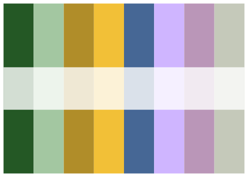

<!-- README.md is generated from README.Rmd. Please edit that file -->

# Benviplot

The `benviplot` package is the new extension of the previous
`quinto_andar_` functions. Theses are `ggplot2` wrappers and helper
functions to create standardized plots that follow the colors of
QuintoAndar Group. The umbrella company name Benvi was announced
officially in the second semester of 2022 and provides a much better
name for the functions.

Since `benviplot` uses `ggplot2` functions it is always advisable to
load both packages.

``` r
library(ggplot2)
library(benviplot)
```

## Color palettes

Color palettes can be visualized using `benvi_palette`.

``` r
benvi_palette("rio_qual")
```



``` r
benvi_palette("Qual2")
```


Although the console prints a palette the hex values can be used
directly.

``` r
as.character(benvi_palette("Qual2"))
#> [1] "#C5C9BA" "#816242" "#F2C037" "#009850" "#466795" "#9A75B4" "#EA4E58"
#> [8] "#C64729"
```

## Plotting

To use the colors in plots use one of the `scale_*_benvi_*` functions:

- `scale_color_benvi_d`
- `scale_color_benvi_c`
- `scale_fill_benvi_c`
- `scale_fill_benvi_d`

Other option is to use `benvi_palette` and `scale_*_manual`. The code
below shows a simple use case.

``` r
ggplot(mtcars, aes(x = wt, y = mpg, color = as.factor(cyl))) +
  geom_point() +
  geom_smooth(color = benvi_palette("Qual9")[5], se = FALSE) + 
  scale_color_benvi_d(pal_name = "Qual9", name = "Cylinders") +
  labs(
    title = "A Benvi styled plot",
    subtitle = "Fontface is defined as Poppins using showtext",
    x = "Weight (tons)",
    y = "Miles per gallon",
    caption = "Poppins font is downloaded using sysfonts::font_add_google or locally.") +
  theme_benvi() +
  theme(axis.text.x = element_text(angle = 0))
#> `geom_smooth()` using method = 'loess' and formula = 'y ~ x'
```


When using a continuous scale the colors are interpolated.

``` r
housing <- subset(txhousing, city %in% c("Austin", "Houston", "Dallas"))

ggplot(housing, aes(x = date, y = city, fill = median)) +
  geom_tile(height = 0.8) +
  scale_fill_benvi_c(pal_name = "Set3", name = "Median House\nPrice ($)") +
  theme_benvi() +
  theme(
    legend.key.size = unit(1, "cm"),
    legend.title = element_text(hjust = 0.5, vjust = 0.75)
    )
```


I also created some `plot_` functions that help to create some standard
plots. These functions aim to save typing when performing data
exploration and can be used in reports.

``` r
plot_line(economics, x = date, y = uempmed)
```


These functions usually include simple helper arguments like `text` in
the case of `plot_column` that plots its value above the column.

``` r
sales <- data.frame(
  x = factor(c(1, 2, 3, 4, 5, 6)),
  y = c(200, 220, 230, 210, 240, 290)
)

plot_column(sales, x = x, y = y, text = TRUE)
```


Making good plots, however, will still usually require lots of typing.
The final example shows the variable argument which replaces the
`aes(fill = ...)` or `aes(color = ...)` in each function.

``` r
plot_scatter(
  mtcars, wt, mpg,
  variable = as.factor(cyl),
  fit = TRUE,
  fit_method = "auto",
  scale_name = "Cylinders") +
  labs(
    title = "A Benvi styled plot",
    subtitle = "Fontface is defined as Poppins using showtext",
    x = "Weight (tons)",
    y = "Miles per gallon",
    caption = "Poppins font is downloaded using sysfonts::font_add_google or locally.") +
  theme(axis.text.x = element_text(angle = 0))
#> `geom_smooth()` using method = 'loess' and formula = 'y ~ x'
```


