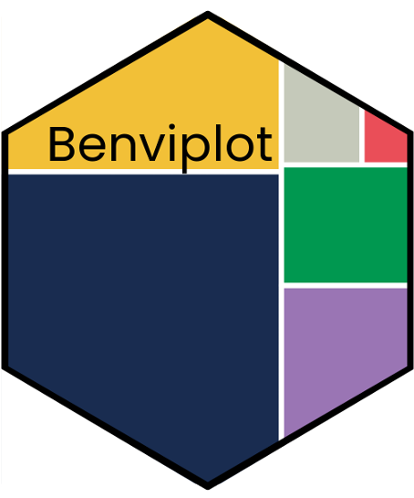
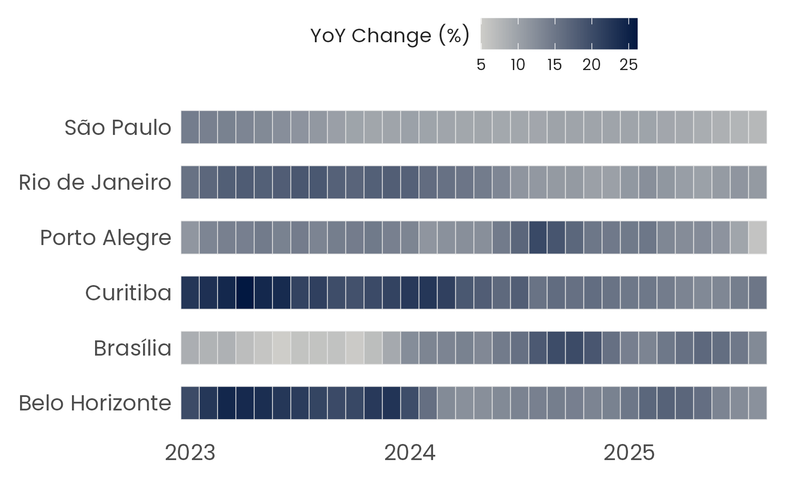

<!-- README.md is generated from README.Rmd. Please edit that file -->

# benviplot 

<!-- badges: start -->

[](https://github.com/viniciusoike/benviplot/actions)
[](https://app.codecov.io/gh/viniciusoike/benviplot?branch=master)
[](https://opensource.org/licenses/MIT)
[](https://lifecycle.r-lib.org/articles/stages.html#stable)
[](https://viniciusoike.r-universe.dev/benviplot)
<!-- badges: end -->

## Overview

`benviplot` provides color palettes and ggplot2 helpers for creating
high quality graphics. The package includes:

- **Color Palettes**: curated color schemes (Set, Qualitative,
  Sequential palettes).
- **ggplot2 Scales**: discrete and continuous scales for seamless
  ggplot2 integration.
- **Plot Helpers**: wrapper functions for common visualizations.
- **Custom Theme**: clean, professional theme with Poppins font support.

## Installation

Install the released version from CRAN:

``` r
install.packages("benviplot")
```

Or install the development version from GitHub:

``` r
# install.packages("remotes")
remotes::install_github("viniciusoike/benviplot")
```

## Font Setup

`benviplot` bundles the Poppins font family and registers it
automatically on load (requires the `systemfonts` package). When Poppins
is registered, `theme_benvi()` uses it by default. Without
`systemfonts`, the theme falls back to the system sans-serif font.

For the best rendering quality, also install the `ragg` package:

``` r
install.packages("ragg")
```

You can verify your current setup with `font_status()`.

## Usage

Load the package along with ggplot2.

``` r
library(ggplot2)
library(benviplot)
```

## Color palettes

Color palettes can be visualized using `benvi_palette`.

``` r
benvi_palette()
```

## Plotting

To use the colors in plots use one of the `scale_*_benvi_*` functions.

- `scale_color_benvi_d`
- `scale_color_benvi_c`
- `scale_fill_benvi_c`
- `scale_fill_benvi_d`

The package also supplies a generic `theme_benvi()` function that works
best if Poppins is available.

``` r
# Rental price index for major cities
index_data <- iqaiw |>
  filter(
    rooms %in% c("1", "2"),
    between(date, as.Date("2023-01-01"), as.Date("2025-12-31"))
  )

ggplot(index_data, aes(date, index, color = rooms)) +
  geom_line(lwd = 0.7) +
  facet_wrap(vars(name_muni)) +
  scale_color_benvi_d() +
  labs(
    title = "IQAIW Rental Index by City",
    x = NULL,
    y = "Index (base = 100)",
    color = "Rooms",
    caption = "Source: IQAIW (benviplot)"
  ) +
  theme_benvi()
```


When using a continuous scale the colors are interpolated.

``` r
# Price per m2 by city over time
index_data <- iqaiw |>
  filter(
    rooms == "Total",
    between(date, as.Date("2023-01-01"), as.Date("2025-12-31"))
  ) |>
  mutate(xdate = lubridate::year(date) + (lubridate::month(date) - 1) / 12)

ggplot(index_data, aes(x = xdate, y = name_muni, fill = acum12m * 100)) +
  geom_tile(height = 0.6, color = "gray90") +
  scale_fill_benvi_c(
    pal_name = "benvi_blue",
    name = "YoY Change (%)",
    direction = -1
  ) +
  scale_x_continuous(
    breaks = seq(2023, 2025, 1),
    expand = expansion(0)
  ) +
  labs(x = NULL, y = NULL) +
  theme_benvi() +
  theme(
    legend.title = element_text(hjust = 0.5, vjust = 0.75),
    axis.text = element_text(size = 12),
    panel.grid = element_blank()
  )
```



The package features some generic `plot_` functions that help to create
standard plots. These functions aim to be efficient, allowing for quick
data exploration, while remaining polished enough to be used for
reports.

These functions usually include simple helper arguments like `text` in
the case of `plot_column` that plots its value above the column.

``` r
sales <- data.frame(
  x = factor(c(1, 2, 3, 4, 5, 6)),
  y = c(200, 220, 230, 210, 240, 290)
)

plot_column(sales, x = x, y = y, text = TRUE)
```


For more examples visit the [pacakge’s
website](https://viniciusoike.github.io/benviplot/)

## Acknowledgments

This package uses color schemes inspired by the Benvi brand. This is an
independent project not affiliated with QuintoAndar.
