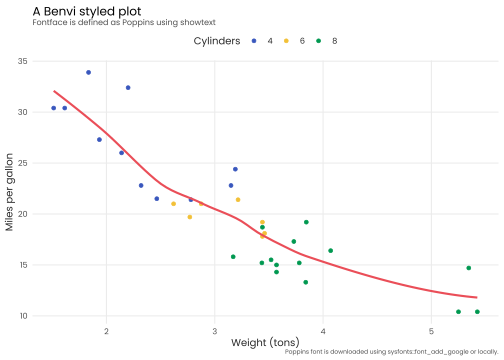

<!-- README.md is generated from README.Rmd. Please edit that file -->

# benviplot 

<!-- badges: start -->

[](https://github.com/viniciusoike/benviplot/actions)
[](https://app.codecov.io/gh/viniciusoike/benviplot?branch=master)
[](https://github.com/viniciusoike/benviplot/actions)
[](https://opensource.org/licenses/MIT)
[](https://lifecycle.r-lib.org/articles/stages.html#stable)
<!-- badges: end -->

> **DISCLAIMER**: This is an unofficial, independent project and is
> **NOT** affiliated with, endorsed by, or connected to QuintoAndar in
> any way. Benvi was a former brand of QuintoAndar that was discontinued
> in 2024. This package uses publicly available color schemes from that
> period for data visualization purposes. See
> [DISCLAIMER.md](DISCLAIMER.md) for details.

## Overview

`benviplot` provides color palettes and ggplot2 helpers for creating
high quality graphics. The package includes:

- **Color Palettes**: curated color schemes (Set, Qualitative,
  Sequential palettes).
- **ggplot2 Scales**: discrete and continuous scales for seamless
  ggplot2 integration.
- **Plot Helpers**: wrapper functions for common visualizations.
- **Custom Theme**: clean, professional theme with Poppins font support.

## Installation

You can install benviplot from GitHub.

``` r
# Install remotes if needed
# install.packages("remotes")

# Install benviplot from GitHub
remotes::install_github("viniciusoike/benviplot")
```

## Usage

Load the package along with ggplot2.

``` r
library(ggplot2)
library(benviplot)
```

## Color palettes

Color palettes can be visualized using `benvi_palette`. The default
palette is “qual_2”.

``` r
# Default palette (qual_2)
benvi_palette()
```


Colors follow Benvi reports guidelines that are tailored for specific
cities.

``` r
# Specify a different palette
benvi_palette("rio_qual")
```


## Plotting

To use the colors in plots use one of the `scale_*_benvi_*` functions.

- `scale_color_benvi_d`
- `scale_color_benvi_c`
- `scale_fill_benvi_c`
- `scale_fill_benvi_d`

The pacakge also supplies a generic `theme_benvi()` function that works
best if Poppins is available.

``` r
# Rental price index for major cities
index_data <- subset(iqaiw, rooms == "Total")

ggplot(index_data, aes(x = date, y = index, color = name_muni)) +
  geom_line(linewidth = 1, alpha = 0.8) +
  scale_color_benvi_d(pal_name = "qual_benvi", name = "City") +
  labs(
    title = "A Benvi styled plot",
    subtitle = "Using the Poppins font for clean typography",
    x = NULL,
    y = "Index (base = 100)") +
  theme_benvi()
```



When using a continuous scale the colors are interpolated.

``` r
# Price per m2 by city over time
ggplot(iqaiw, aes(x = date, y = name_muni, fill = price_m2)) +
  geom_tile(height = 0.8) +
  scale_fill_benvi_c(pal_name = "benvi_blue", name = "Price (R$/m²)") +
  scale_x_continuous(expand = expansion(0)) +
  labs(x = NULL, y = NULL) +
  theme_benvi() +
  theme(
    legend.title = element_text(hjust = 0.5, vjust = 0.75),
    axis.text = element_text(size = 12),
    panel.grid = element_blank()
    )
```


The package features some generic `plot_` functions that help to create
standard plots. These functions aim to be efficient, allowing for quick
data exploration, while remaining polished enough to be used for
reports.

These functions usually include simple helper arguments like `text` in
the case of `plot_column` that plots its value above the column.

``` r
sales <- data.frame(
  x = factor(c(1, 2, 3, 4, 5, 6)),
  y = c(200, 220, 230, 210, 240, 290)
)

plot_column(sales, x = x, y = y, text = TRUE)
```


The final example shows the variable argument which replaces the
`aes(fill = ...)` or `aes(color = ...)` in each function.

``` r
# Listing vs contract prices by city
latest_sales <- subset(sales_report, date == max(date))
plot_scatter(
  latest_sales, price_m2_listing, price_m2_contract,
  variable = name_muni,
  fit = TRUE,
  fit_method = "lm",
  scale_name = "City")
#> `geom_smooth()` using formula = 'y ~ x'
```


## Getting Help

- **Documentation**: Access via `?benviplot` or visit
  <https://viniciusoike.github.io/benviplot/>
- **Issues**: Report bugs at
  <https://github.com/viniciusoike/benviplot/issues>
- **Questions**: Open a discussion on GitHub

## License

MIT License. See [LICENSE.md](LICENSE.md) for details.

## Acknowledgments

This package uses color schemes inspired by the discontinued Benvi
brand. This is an independent project not affiliated with QuintoAndar.
