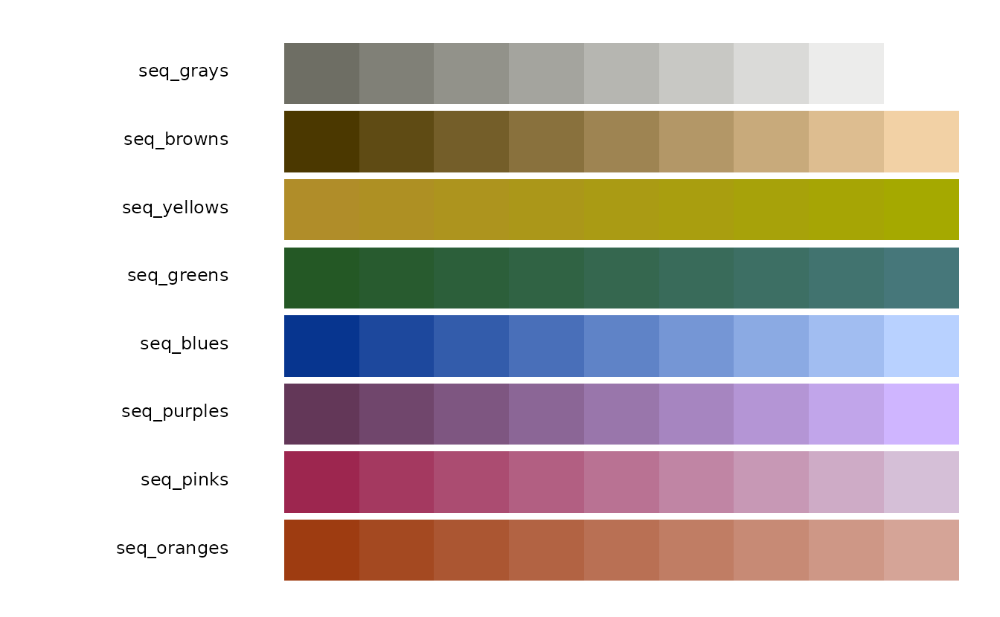
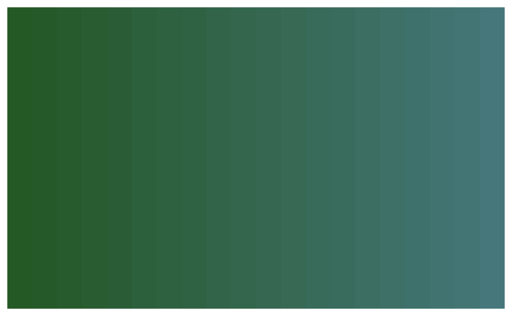
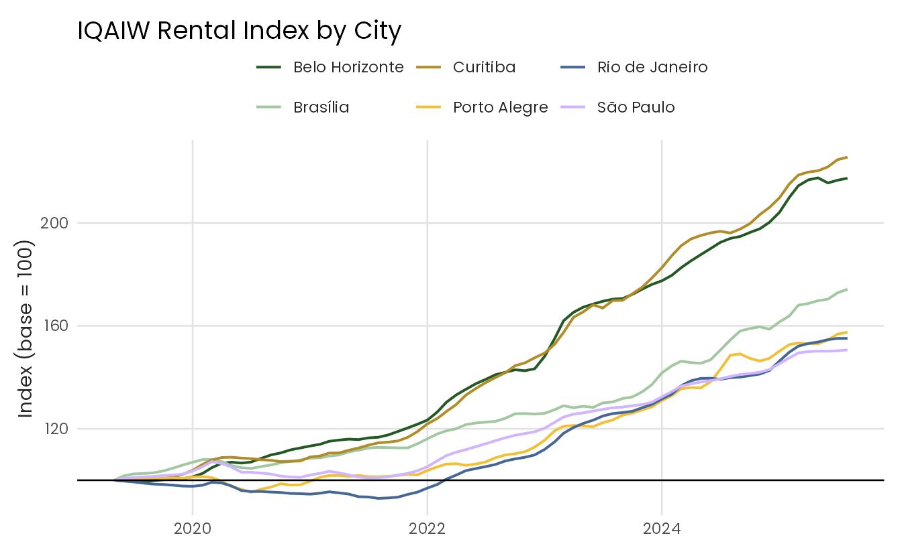
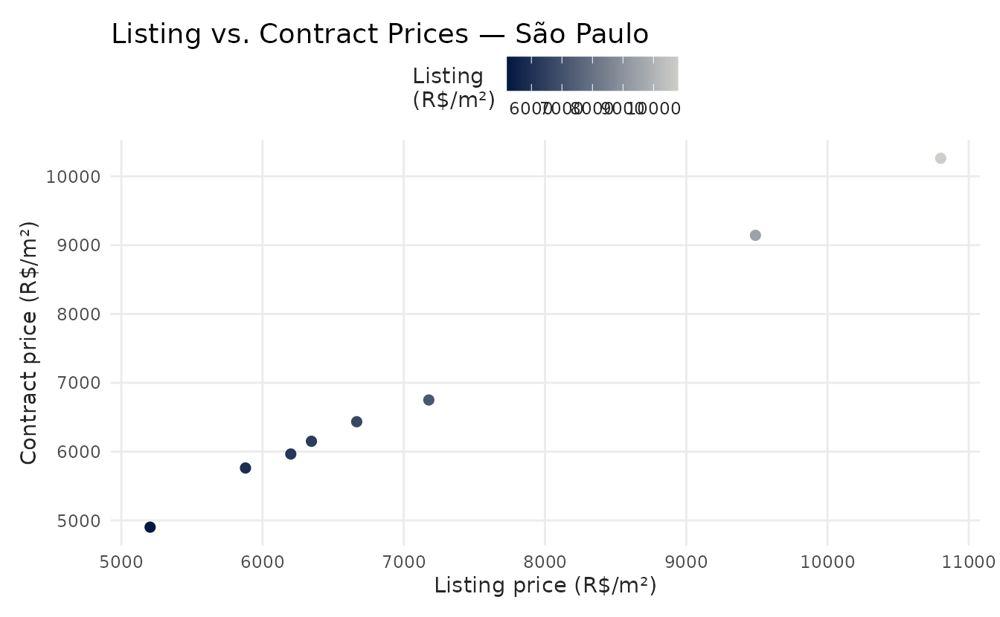
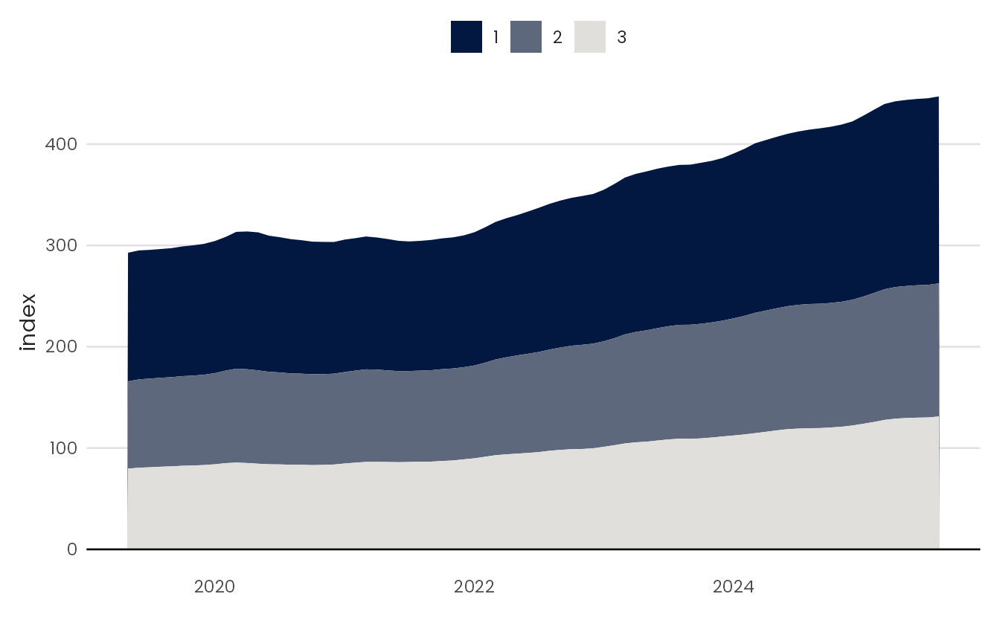
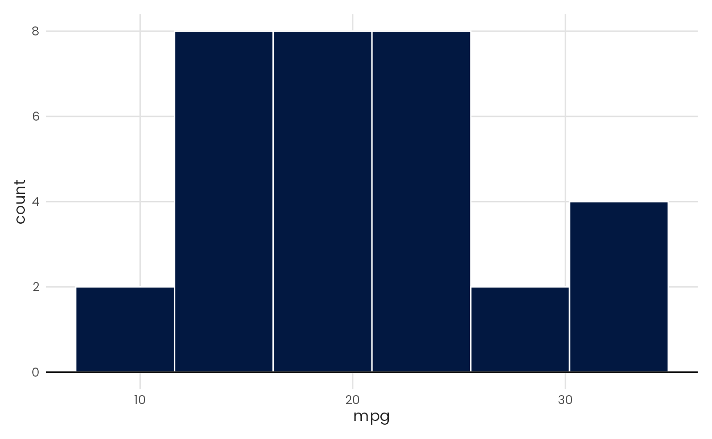
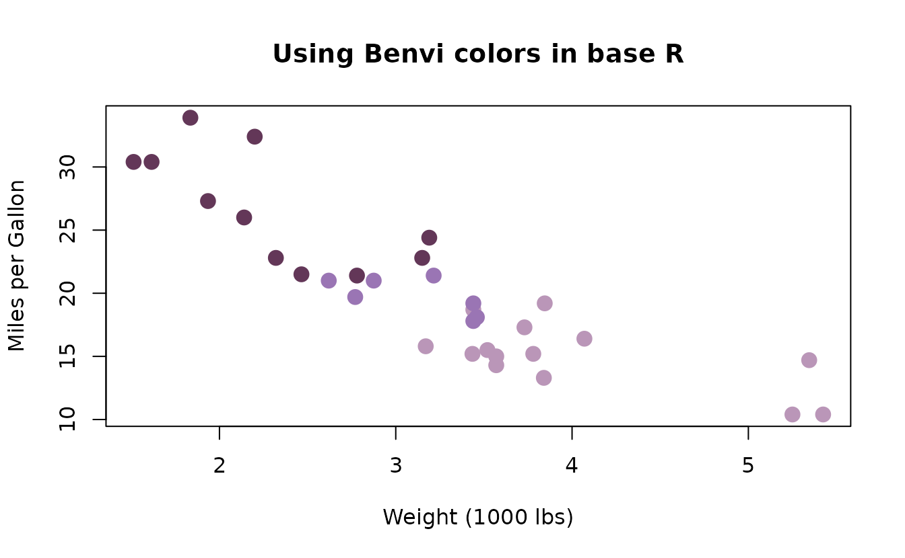

# Getting Started with benviplot

## Introduction

`benviplot` provides color palettes and ggplot2 helper functions for
exploratory data analysis. The color schemes are based on Benvi, a brand
of the Brazilian proptech QuintoAndar.[^1] The package includes a custom
ggplot2 theme, discrete and continuous color scales, and wrappers for
common chart types.

### Installation

``` r

# Install remotes if needed
install.packages("remotes")

remotes::install_github("viniciusoike/benviplot")
```

### Optional font setup

`benviplot` bundles the Poppins font family. When both `systemfonts` and
`ragg` are available, the package registers Poppins and
[`theme_benvi()`](https://viniciusoike.github.io/benviplot/reference/theme_benvi.md)
uses it by default. Otherwise, the theme uses the system sans-serif
font.

Install `ragg` to render Poppins in PNG files. Base PDF and PostScript
devices cannot use fonts registered through `systemfonts`; use
`base_family = "sans"` with those devices.

``` r

install.packages("ragg")
```

Check whether Poppins and `ragg` are available with
[`font_status()`](https://viniciusoike.github.io/benviplot/reference/font_status.md).

``` r

font_status()
```

## Quick start

``` r

library(ggplot2)
library(benviplot)
```

Combine
[`theme_benvi()`](https://viniciusoike.github.io/benviplot/reference/theme_benvi.md)
with the `scale_*_benvi_*()` functions to style a ggplot2 chart. In the
example below,
[`scale_fill_benvi_d()`](https://viniciusoike.github.io/benviplot/reference/ggplot2-scales-discrete.md)
maps the discrete cylinder variable to the `"qual_8"` qualitative
palette.
[`theme_benvi()`](https://viniciusoike.github.io/benviplot/reference/theme_benvi.md)
sets the remaining theme elements.

``` r

ggplot(mtcars, aes(x = wt, y = mpg, fill = as.factor(cyl))) +
  geom_point(shape = 21, size = 3, color = "#000000") +
  scale_fill_benvi_d(name = "Cylinders", pal_name = "qual_8") +
  labs(
    title = "Fuel Efficiency vs. Weight",
    x = "Weight (1000 lbs)",
    y = "Miles per Gallon"
  ) +
  theme_benvi()
```


## Color palettes

The package organizes its palettes into theme, sequential, qualitative,
diverging, city-specific, and brand families. Choose a family based on
the variable and the role of color in the chart.

### Browsing palettes

[`show_palettes()`](https://viniciusoike.github.io/benviplot/reference/show_palettes.md)
displays the available palettes. Calling it without arguments shows
every palette; pass a type name to narrow the output.

``` r

show_palettes()
```

Filter the display with `"theme"`, `"sequential"`, `"qualitative"`,
`"diverging"`, `"city"`, or `"brand"`.

``` r

show_palettes("sequential")
```



### Accessing palette colors

[`benvi_palette()`](https://viniciusoike.github.io/benviplot/reference/benvi_palette.md)
returns a `palette` object backed by hexadecimal color values. Printing
the object draws color swatches on the active graphics device.

``` r

# Preview a palette
benvi_palette("qual_2")
```


To pass the colors to another package, coerce the result to a plain
character vector.

``` r

# Get hex codes as a plain character vector
as.character(benvi_palette("benvi_blue"))
#>  [1] "#021841" "#192C50" "#2F405F" "#46546E" "#5D687D" "#737C8C" "#8A919C"
#>  [8] "#A0A5AB" "#B7B9BA" "#CECDC9"
```

Discrete palettes contain between 4 and 9 fixed colors. Set
`type = "continuous"` to interpolate more colors along the palette
gradient.

``` r

benvi_palette("seq_greens", n = 20, type = "continuous")
```



## Using ggplot2 scales

The scale functions follow the ggplot2 naming pattern
`scale_{aesthetic}_benvi_{d|c}()`. The suffix `d` denotes a discrete
scale, and `c` denotes a continuous scale. Both `color` and `fill`
variants are available; `colour` spellings are aliases of the `color`
functions.

### Discrete scales

Discrete scales map categorical variables to fixed colors. Qualitative
palettes usually work best for this purpose, but `pal_name` accepts any
package palette.

``` r

iqaiw_total <- subset(iqaiw, rooms == "Total")

ggplot(iqaiw_total, aes(x = date, y = index, color = name_muni)) +
  geom_line(linewidth = 0.7) +
  geom_hline(yintercept = 100) +
  scale_color_benvi_d("rio_qual", name = NULL) +
  labs(
    title = "IQAIW Rental Index by City",
    x = NULL,
    y = "Index (base = 100)"
  ) +
  theme_benvi()
```



### Continuous scales

Continuous scales interpolate colors from any package palette.
Sequential palettes usually work best for ordered numeric values. Use
`direction = -1` to reverse the palette.

``` r

iqaiw_total <- subset(iqaiw_total, !is.na(acum12m))

ggplot(iqaiw_total, aes(x = date, y = name_muni, fill = acum12m * 100)) +
  geom_tile(height = 0.6, color = "#ffffff") +
  scale_fill_benvi_c(
    pal_name = "benvi_blue",
    name = "YoY Change (%)",
    direction = -1
  ) +
  scale_x_date(
    date_breaks = "1 year",
    date_labels = "%Y",
    expand = expansion(0)
  ) +
  labs(x = NULL, y = NULL) +
  theme_benvi() +
  theme(
    legend.title = element_text(hjust = 0.5, vjust = 0.75),
    axis.text = element_text(size = 12),
    panel.grid = element_blank()
  )
```



## Plot helper functions

`benviplot` includes wrappers for common chart types. These functions
accept a data frame and unquoted column names, apply
[`theme_benvi()`](https://viniciusoike.github.io/benviplot/reference/theme_benvi.md),
and return a `ggplot` object. Build charts directly with ggplot2 when
you need finer control.

### Line chart

[`plot_line()`](https://viniciusoike.github.io/benviplot/reference/plot_line.md)
draws a single-series line chart. Pass `color` to map a grouping
variable and draw multiple lines with a legend.

``` r

spo_index <- subset(iqaiw, name_muni == "São Paulo" & rooms == "Total")
plot_line(spo_index, x = date, y = index)
```


### Bar chart

[`plot_column()`](https://viniciusoike.github.io/benviplot/reference/plot_column.md)
creates a vertical bar chart. Setting `text = TRUE` adds value labels
above each bar. Set `text_inside = TRUE` to place the labels inside the
bars; this option requires the `ggfittext` package.

``` r

latest_sales <- subset(
  sales_report,
  name_muni == "Belo Horizonte" & date == max(date)
)

plot_column(latest_sales, x = name_zone, y = price_m2, text = TRUE)
```


### Scatter plot

[`plot_scatter()`](https://viniciusoike.github.io/benviplot/reference/plot_scatter.md)
maps `x` and `y` to a scatter plot. Pass a variable to `color` to apply
a Benvi palette to the points. Set `fit = TRUE` to add a fitted line.

``` r

plot_scatter(
  mtcars,
  x = wt,
  y = mpg,
  color = as.factor(cyl),
  pal_name = "qual_5",
  scale_name = "Cylinders",
  fit = TRUE
)
```


### Area chart

[`plot_area()`](https://viniciusoike.github.io/benviplot/reference/plot_area.md)
draws a single area or maps a grouping variable to `fill` to draw
stacked areas.

``` r

room_index <- subset(
  iqaiw,
  name_muni == "São Paulo" & rooms %in% c("1", "2", "3")
)

plot_area(room_index, x = date, y = index, fill = rooms)
```



### Histogram

[`plot_histogram()`](https://viniciusoike.github.io/benviplot/reference/plot_histogram.md)
selects the bin width with the Freedman–Diaconis rule by default. Set
`bins` to choose the number of bins directly.

``` r

plot_histogram(mtcars, x = mpg)
```



### Adding layers

Because the helpers return `ggplot` objects, you can add layers, scales,
and theme adjustments with the usual ggplot2 syntax.

``` r

plot_line(spo_index, x = date, y = index) +
  geom_smooth(se = FALSE, color = benvi_palette("oranges")[3]) +
  labs(
    title = "Rental Price Index in São Paulo",
    subtitle = "Smoothed trend",
    x = NULL,
    y = "Index (base = 100)",
    caption = "Source: IQAIW"
  )
```


## Base R

The palettes are not tied to ggplot2. Convert a palette to a character
vector to use its hexadecimal color values with base R graphics,
lattice, or another plotting system.

``` r

colors <- as.character(benvi_palette("purples"))

plot(
  mtcars$wt,
  mtcars$mpg,
  col = colors[mtcars$cyl / 2 - 1],
  pch = 19,
  cex = 1.5,
  xlab = "Weight (1000 lbs)",
  ylab = "Miles per Gallon",
  main = "Using Benvi colors in base R"
)
```



## Getting help

- Open function documentation with
  [`?benvi_palette`](https://viniciusoike.github.io/benviplot/reference/benvi_palette.md),
  [`?theme_benvi`](https://viniciusoike.github.io/benviplot/reference/theme_benvi.md),
  or
  [`?scale_color_benvi_d`](https://viniciusoike.github.io/benviplot/reference/ggplot2-scales-discrete.md).
- Browse the [package
  website](https://viniciusoike.github.io/benviplot/).
- Report problems in the [GitHub issue
  tracker](https://github.com/viniciusoike/benviplot/issues).

[^1]: The color information is publicly available. This project is not
    affiliated with QuintoAndar.
