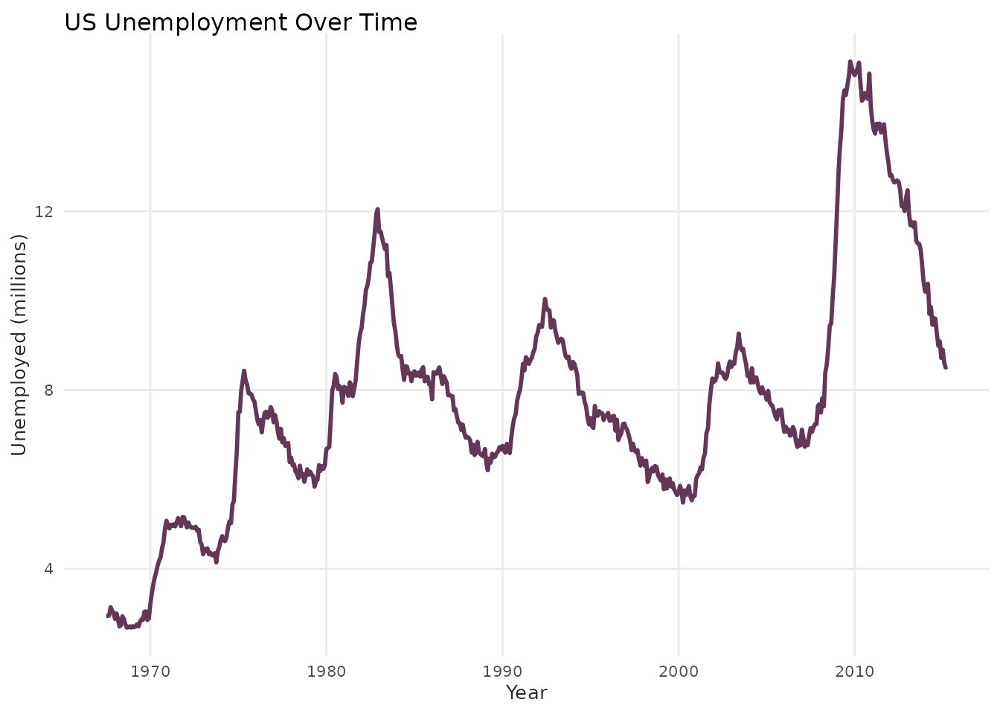
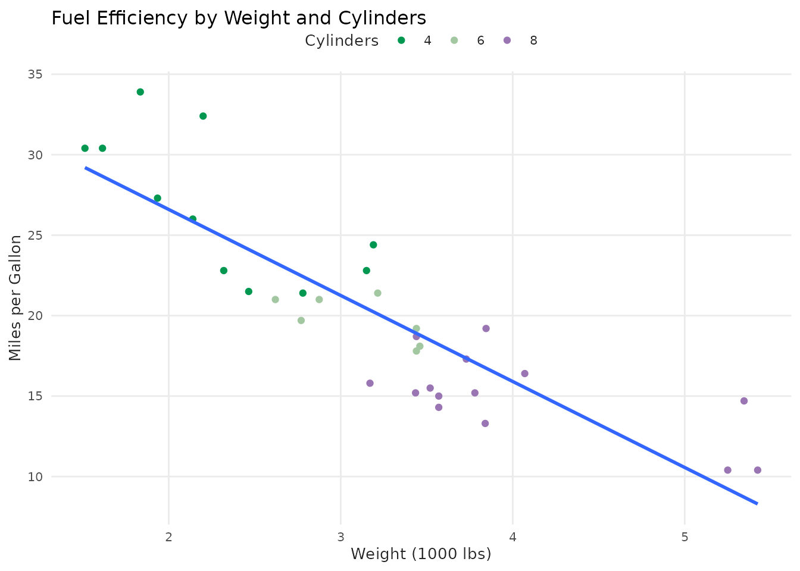
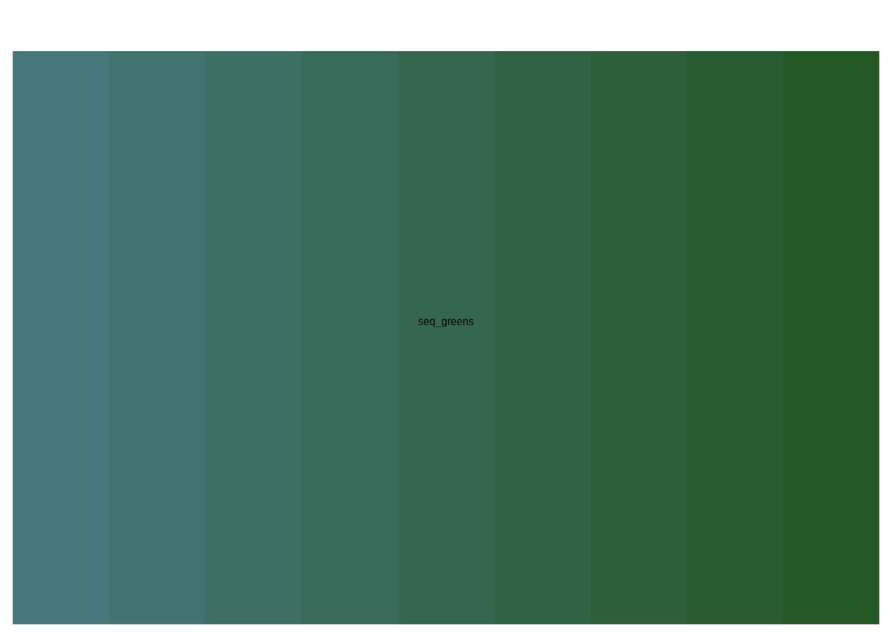
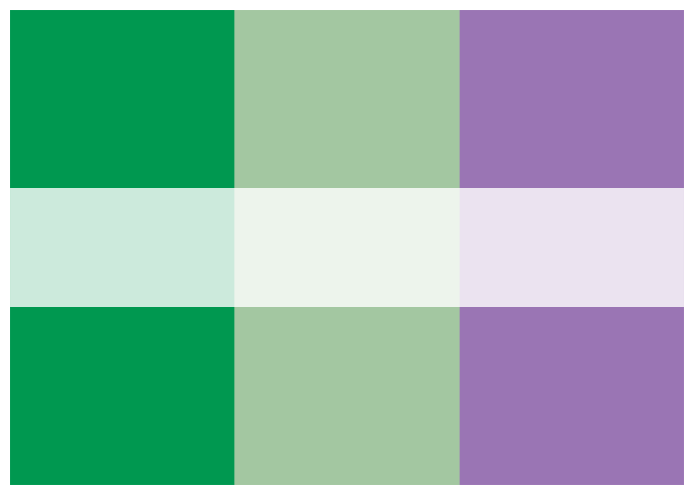
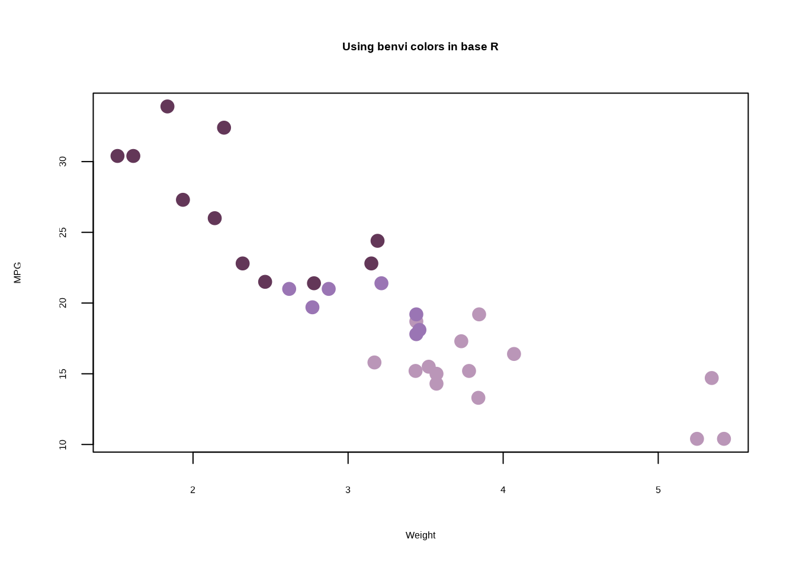

# Getting Started with benviplot

## Introduction

Welcome to `benviplot`! This package provides a comprehensive set of
tools for creating beautiful, publication-ready visualizations in R
using ggplot2.

### What is benviplot?

`benviplot` offers:

- **Curated Color Palettes**: Professional color schemes optimized for
  data visualization
- **ggplot2 Integration**: Seamless scales for both discrete and
  continuous data
- **Plot Helpers**: Convenience functions for common chart types
- **Custom Theme**: Clean, modern theme with professional typography

### Disclaimer

**IMPORTANT**: This is an unofficial, independent project created by
Vinicius Oike and is **NOT** affiliated with, endorsed by, or connected
to QuintoAndar in any way. Benvi was a former brand of QuintoAndar that
was discontinued in 2024. This package uses publicly available color
schemes from that period for data visualization purposes.

## Installation

Install `benviplot` from GitHub:

``` r

# Install remotes if needed
if (!requireNamespace("remotes", quietly = TRUE)) {
  install.packages("remotes")
}

# Install benviplot
remotes::install_github("viniciusoike/benviplot")
```

### System Requirements

- **R**: Version 4.1.0 or higher
- **ggplot2**: Version 4.0.0 or higher

## Font Setup (Optional but Recommended)

`benviplot` uses the **Poppins** font family from Google Fonts for
professional typography. Installing Poppins is **optional** - the theme
will automatically fall back to your system’s default font if Poppins
isn’t available.

### One-Command Setup

The easiest way to set up fonts:

``` r

library(benviplot)

# One-time setup - installs Poppins and configures graphics
setup_benvi_fonts()
```

This command will: 1. Download and install Poppins to your system 2.
Check for the ragg package (recommended for best quality) 3. Provide
guidance for RStudio configuration

**You only need to do this once per computer!**

### What if I skip font setup?

No problem! The package will work perfectly fine without Poppins. You’ll
see a one-time message suggesting installation, but all functionality
will work with your system’s default font.

### Detailed Font Setup

For detailed installation instructions, troubleshooting, and information
about the new font system, see:

``` r

vignette("font-setup")
```

## Quick Start

Let’s create your first plot with benviplot!

``` r

library(ggplot2)
library(benviplot)

# Use built-in mtcars dataset
head(mtcars)
#>                    mpg cyl disp  hp drat    wt  qsec vs am gear carb
#> Mazda RX4         21.0   6  160 110 3.90 2.620 16.46  0  1    4    4
#> Mazda RX4 Wag     21.0   6  160 110 3.90 2.875 17.02  0  1    4    4
#> Datsun 710        22.8   4  108  93 3.85 2.320 18.61  1  1    4    1
#> Hornet 4 Drive    21.4   6  258 110 3.08 3.215 19.44  1  0    3    1
#> Hornet Sportabout 18.7   8  360 175 3.15 3.440 17.02  0  0    3    2
#> Valiant           18.1   6  225 105 2.76 3.460 20.22  1  0    3    1
```

### A Simple Scatter Plot

``` r

ggplot(mtcars, aes(x = wt, y = mpg, color = as.factor(cyl))) +
  geom_point(size = 3) +
  scale_color_benvi_d(pal_name = "qual_2", name = "Cylinders") +
  labs(
    title = "Fuel Efficiency vs. Weight",
    x = "Weight (1000 lbs)",
    y = "Miles per Gallon"
  ) +
  theme_benvi()
```


That’s it! Just three key components:

1.  [`scale_color_benvi_d()`](https://viniciusoike.github.io/benviplot/reference/ggplot2-scales-discrete.md):
    Applies benvi discrete color palette
2.  [`theme_benvi()`](https://viniciusoike.github.io/benviplot/reference/theme_benvi.md):
    Applies benvi visual theme
3.  `palette = "qual_2"`: Selects specific color palette

## Viewing Color Palettes

Before using a palette, you can preview it:

``` r

# View a qualitative palette
benvi_palette("qual_2")
```


``` r


# View a sequential palette
benvi_palette("seq_greens")
```


``` r


# View a set palette
benvi_palette("purples")
```


### Getting Hex Color Values

Extract hex codes for use outside ggplot2:

``` r

# Get hex codes as character vector
colors <- as.character(benvi_palette("qual_2"))
colors
#> [1] "#C5C9BA" "#816242" "#F2C037" "#009850" "#466795" "#9A75B4" "#EA4E58"
#> [8] "#C64729"

# Use specific colors
my_blue <- benvi_palette("qual_2")[1]
my_blue
#> [1] "#C5C9BA"
```

## Basic Examples

### Bar Chart with Discrete Colors

``` r

# Sample data
sales <- data.frame(
  product = c("A", "B", "C", "D", "E"),
  revenue = c(120, 200, 150, 180, 220)
)

ggplot(sales, aes(x = product, y = revenue, fill = product)) +
  geom_col(show.legend = FALSE) +
  scale_fill_benvi_d(pal_name = "greens") +
  labs(
    title = "Revenue by Product",
    x = "Product",
    y = "Revenue ($1000s)"
  ) +
  theme_benvi()
```


### Line Chart with Groups

``` r

# Use built-in economics dataset
ggplot(economics, aes(x = date, y = unemploy / 1000)) +
  geom_line(color = benvi_palette("purples")[1], linewidth = 1) +
  labs(
    title = "US Unemployment Over Time",
    x = "Year",
    y = "Unemployed (millions)"
  ) +
  theme_benvi()
```



### Heatmap with Continuous Colors

``` r

# Sample data - Texas housing
housing <- subset(txhousing, city %in% c("Austin", "Houston", "Dallas"))

ggplot(housing, aes(x = date, y = city, fill = median)) +
  geom_tile() +
  scale_fill_benvi_c(pal_name = "seq_purples", name = "Median\nPrice ($)") +
  labs(
    title = "Median House Prices in Texas Cities",
    x = "Year",
    y = NULL
  ) +
  theme_benvi()
```


## Using Plot Helper Functions

`benviplot` includes convenience functions for common plot types. These
save typing during exploratory data analysis.

### Simple Line Plot

``` r

plot_line(economics, x = date, y = uempmed)
```


### Column Plot with Labels

``` r

plot_column(sales, x = product, y = revenue, text = TRUE)
```


### Scatter Plot with Grouping

``` r

plot_scatter(
  mtcars,
  x = wt,
  y = mpg,
  variable = as.factor(cyl),
  palette = "qual_5",
  scale_name = "Cylinders"
)
```


### Adding Trend Lines

``` r

plot_scatter(
  mtcars,
  x = wt,
  y = mpg,
  variable = as.factor(cyl),
  fit = TRUE,
  fit_method = "lm",
  palette = "qual_5",
  scale_name = "Cylinders"
) +
  labs(
    title = "Fuel Efficiency by Weight and Cylinders",
    x = "Weight (1000 lbs)",
    y = "Miles per Gallon"
  )
```



## Customizing Your Plots

Helper functions return ggplot2 objects, so you can add layers:

``` r

plot_line(economics, x = date, y = unemploy / 1000) +
  geom_smooth(se = FALSE, color = benvi_palette("browns")[2]) +
  labs(
    title = "US Unemployment with Smoothed Trend",
    subtitle = "Unemployment figures in millions",
    x = "Year",
    y = "Unemployed (millions)",
    caption = "Data: economics dataset"
  ) +
  theme_benvi()
```


## Understanding Palette Types

`benviplot` organizes palettes by use case:

### Qualitative Palettes (Qual1-Qual9)

**Use for**: Categorical data without inherent order (e.g., product
types, regions)

- 8 distinct colors
- Optimized for visual differentiation
- Examples: `Qual1`, `Qual2`, …, `Qual9`

``` r

benvi_palette("qual_3")
```

### Sequential Palettes (Seq0-Seq7)

**Use for**: Continuous data with ordered progression (e.g.,
temperature, percentages)

- 9-color gradients
- Light to dark progression
- Examples: `Seq0`, `Seq1`, …, `Seq7`

``` r

benvi_palette("seq_yellows")
```

### Set Palettes (Set0-Set7)

**Use for**: Small categorical datasets (2-4 categories)

- 4 carefully chosen colors
- Good contrast and balance
- Examples: `Set0`, `Set1`, …, `Set7`

``` r

benvi_palette("blues")
```

### City-Specific Palettes

Themed palettes for Brazilian cities:

- `spo_qual`, `spo_seq`, `spo_div`: São Paulo
- `rio_qual`, `rio_seq`, `rio_div`: Rio de Janeiro
- `bhe_qual`, `bhe_seq`, `bhe_div`: Belo Horizonte

``` r

benvi_palette("rio_qual")
```

## Next Steps

Now that you’re familiar with the basics:

1.  **Explore all palettes**: See
    [`vignette("color-palettes")`](https://viniciusoike.github.io/benviplot/articles/color-palettes.md)
    for complete gallery
2.  **Learn plot functions**: Check
    [`vignette("plot-functions")`](https://viniciusoike.github.io/benviplot/articles/plot-functions.md)
    for detailed examples
3.  **Customize themes**: Read
    [`vignette("themes-and-styling")`](https://viniciusoike.github.io/benviplot/articles/themes-and-styling.md)
    for advanced styling

## Common Questions

### How do I choose the right palette?

- **Categorical data** (no order): Use `Qual*` palettes
- **Continuous/ordered data**: Use `Seq*` palettes
- **Small categories (≤4)**: Use `Set*` palettes
- **Geographic data**: Consider city-specific palettes

### Can I reverse a palette?

Yes! Use `direction = -1`:

``` r

# Normal direction
benvi_palette("seq_greens")
```


``` r


# Reversed
benvi_palette("seq_greens", direction = -1)
```



### How do I use fewer colors than available?

Specify the number with `n`:

``` r

# Get only 3 colors from an 8-color palette
benvi_palette("qual_5", n = 3)
```



### Can I use benvi colors in base R plots?

Yes! Get hex codes and use them:

``` r

colors <- as.character(benvi_palette("purples"))

plot(
  mtcars$wt,
  mtcars$mpg,
  col = colors[mtcars$cyl / 2 - 1],
  pch = 19,
  cex = 1.5,
  xlab = "Weight",
  ylab = "MPG",
  main = "Using benvi colors in base R"
)
```



## Getting Help

- **Function documentation**:
  [`?benvi_palette`](https://viniciusoike.github.io/benviplot/reference/benvi_palette.md),
  [`?scale_color_benvi_d`](https://viniciusoike.github.io/benviplot/reference/ggplot2-scales-discrete.md),
  etc.
- **Package website**: <https://viniciusoike.github.io/benviplot/>
- **Report issues**: <https://github.com/viniciusoike/benviplot/issues>
- **Ask questions**: Open a GitHub discussion

## Summary

In this vignette you learned how to:

- [x] Install and set up benviplot
- [x] Set up Poppins fonts (optional)
- [x] View and select color palettes
- [x] Create plots with benvi scales and themes
- [x] Use plot helper functions
- [x] Choose appropriate palettes for your data

Happy plotting!
