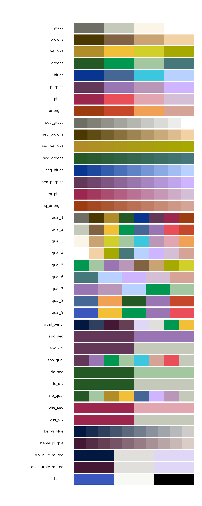

# Getting Started with benviplot

## Introduction

`benviplot` provides color palettes and ggplot2 helper functions for
exploratory data analysis. The color schemes are based on Benvi, a
discontinued brand of the Brazilian proptech QuintoAndar. All color
information used here is publicly available and this project is not
affiliated with QuintoAndar.

## Installation

``` r

# Install remotes if needed
if (!requireNamespace("remotes", quietly = TRUE)) {
  install.packages("remotes")
}

remotes::install_github("viniciusoike/benviplot")
```

## Font Setup (Optional)

`benviplot` uses the **Poppins** font family from Google Fonts.
Installing it is optional —
[`theme_benvi()`](https://viniciusoike.github.io/benviplot/reference/theme_benvi.md)
falls back to the system’s default sans-serif font automatically.

``` r

library(benviplot)

# One-time installation (requires internet and the systemfonts package)
install_poppins()

# Check your current font and graphics device status
font_status()
```

## Quick Start

``` r

library(ggplot2)
library(benviplot)
```

The core of the package is
[`theme_benvi()`](https://viniciusoike.github.io/benviplot/reference/theme_benvi.md)
combined with the `scale_*_benvi_*()` functions.

``` r

ggplot(mtcars, aes(x = wt, y = mpg, fill = as.factor(cyl))) +
  geom_point(shape = 21, size = 3, color = "#000000") +
  scale_fill_benvi_d(name = "Cylinders", pal_name = "qual_8") +
  labs(
    title = "Fuel Efficiency vs. Weight",
    x = "Weight (1000 lbs)",
    y = "Miles per Gallon"
  ) +
  theme_benvi()
```


## Color Palettes

### Browsing palettes

[`show_palettes()`](https://viniciusoike.github.io/benviplot/reference/show_palettes.md)
gives a visual overview of all available palettes, modelled on
[`RColorBrewer::display.brewer.all()`](https://rdrr.io/pkg/RColorBrewer/man/ColorBrewer.html).

``` r

show_palettes()
```



You can filter by type: `"theme"`, `"sequential"`, `"qualitative"`,
`"city"`, or `"brand"`.

``` r

show_palettes("sequential")
```


### Accessing palette colors

[`benvi_palette()`](https://viniciusoike.github.io/benviplot/reference/benvi_palette.md)
returns a vector of hex codes. Print it to preview the swatch.

``` r

# Preview a palette
benvi_palette("qual_2")
```


``` r


# Get hex codes as a plain character vector
as.character(benvi_palette("benvi_blue"))
#>  [1] "#021841" "#192C50" "#2F405F" "#46546E" "#5D687D" "#737C8C" "#8A919C"
#>  [8] "#A0A5AB" "#B7B9BA" "#CECDC9"
```

Discrete palettes have 4–9 colors; use `type = "continuous"` to
interpolate any number.

``` r

benvi_palette("seq_greens", n = 20, type = "continuous")
```


## Using ggplot2 Scales

### Discrete scale

``` r

iqaiw_total <- subset(iqaiw, rooms == "Total")

ggplot(iqaiw_total, aes(x = date, y = index, color = name_muni)) +
  geom_line(linewidth = 0.8) +
  scale_color_benvi_d(pal_name = "qual_6", name = NULL) +
  labs(
    title = "IQAIW Rental Index by City",
    x = NULL,
    y = "Index (base = 100)"
  ) +
  theme_benvi()
```


### Continuous scale

``` r

spo_sales <- subset(sales_report, name_muni == "São Paulo" & date == max(date))

ggplot(spo_sales, aes(x = price_m2_listing, y = price_m2_contract,
                      color = price_m2_listing)) +
  geom_point(size = 2) +
  scale_color_benvi_c(pal_name = "benvi_blue", name = "Listing\n(R$/m²)") +
  labs(
    title = "Listing vs. Contract Prices — São Paulo",
    x = "Listing price (R$/m²)",
    y = "Contract price (R$/m²)"
  ) +
  theme_benvi()
```


## Plot Helper Functions

`benviplot` includes convenience wrappers for common chart types. Each
returns a `ggplot2` object so additional layers can be added normally.

### Line chart

``` r

plot_line(economics, x = date, y = uempmed)
```


### Bar chart

``` r

sales <- data.frame(
  cities  = c("São Paulo", "Rio de Janeiro", "Belo Horizonte", "Porto Alegre", "Curitiba"),
  revenue = c(125, 200, 150, 175, 80)
)

plot_column(sales, x = cities, y = revenue, text = TRUE)
```


### Scatter plot

``` r

plot_scatter(
  mtcars,
  x        = wt,
  y        = mpg,
  variable = as.factor(cyl),
  palette  = "qual_8",
  scale_name = "Cylinders"
)
```


### Adding layers

Because helpers return `ggplot2` objects, you can extend them freely.

``` r

plot_line(economics, x = date, y = unemploy / 1000) +
  geom_smooth(se = FALSE, color = benvi_palette("oranges")[3]) +
  labs(
    title    = "US Unemployment with Smoothed Trend",
    subtitle = "Unemployment figures in millions",
    x = NULL,
    y = "Unemployed (millions)",
    caption  = "Data: economics dataset"
  )
```


## Base R

[`benvi_palette()`](https://viniciusoike.github.io/benviplot/reference/benvi_palette.md)
returns plain hex codes, so it works with base R graphics too.

``` r

colors <- as.character(benvi_palette("purples"))

plot(
  mtcars$wt, mtcars$mpg,
  col  = colors[mtcars$cyl / 2 - 1],
  pch  = 19,
  cex  = 1.5,
  xlab = "Weight (1000 lbs)",
  ylab = "Miles per Gallon",
  main = "Using Benvi colors in base R"
)
```


## Getting Help

- **Function documentation**:
  [`?benvi_palette`](https://viniciusoike.github.io/benviplot/reference/benvi_palette.md),
  [`?theme_benvi`](https://viniciusoike.github.io/benviplot/reference/theme_benvi.md),
  [`?scale_color_benvi_d`](https://viniciusoike.github.io/benviplot/reference/ggplot2-scales-discrete.md)
- **Package website**: <https://viniciusoike.github.io/benviplot/>
- **Report issues**: <https://github.com/viniciusoike/benviplot/issues>
