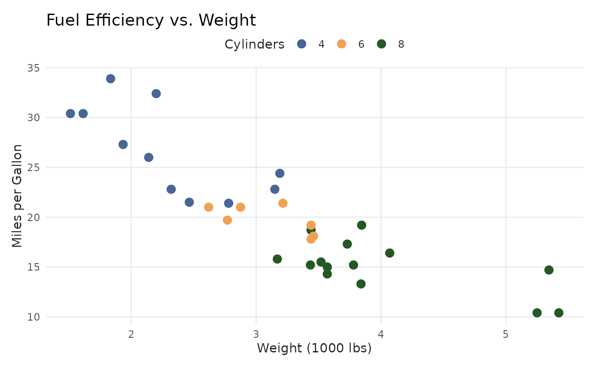
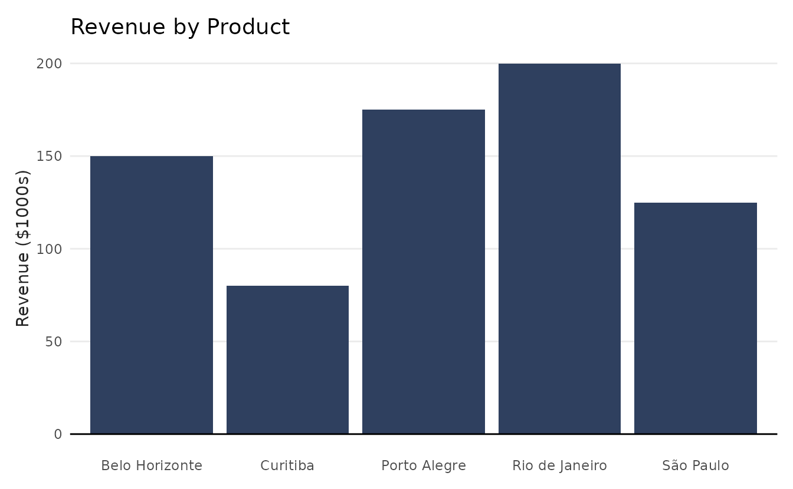
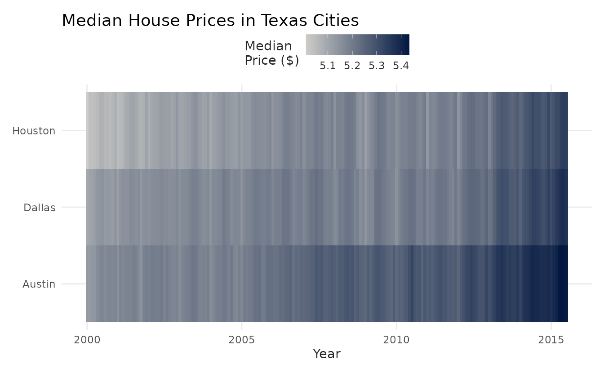
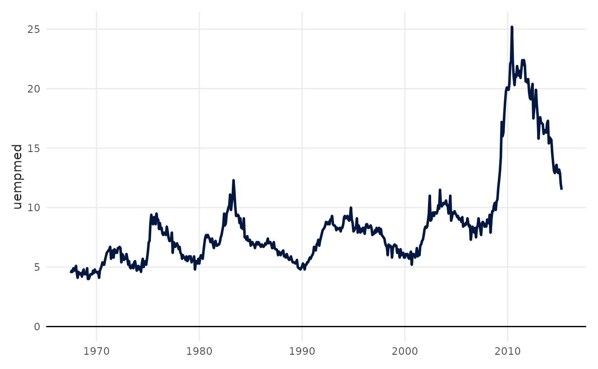
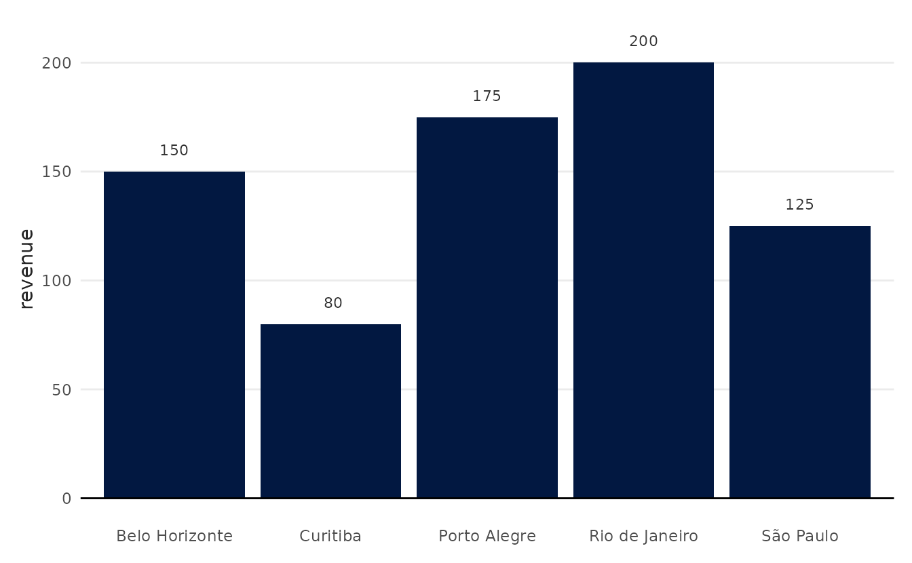
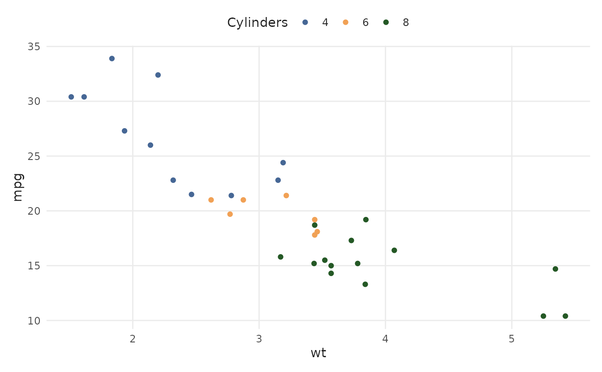
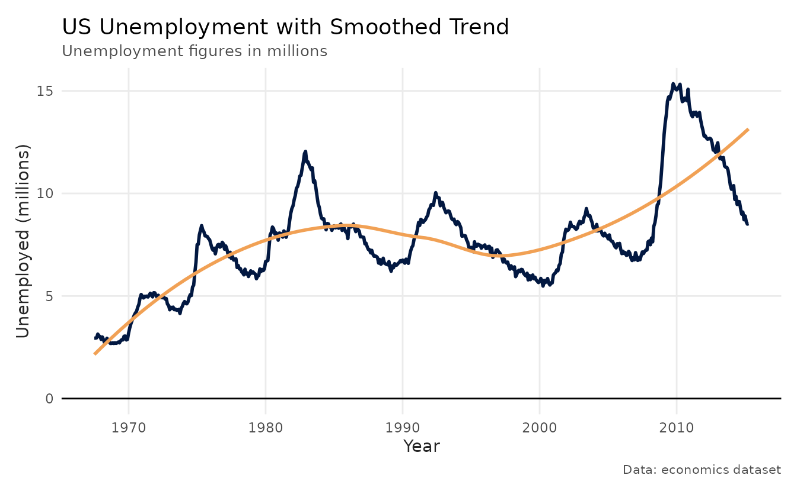
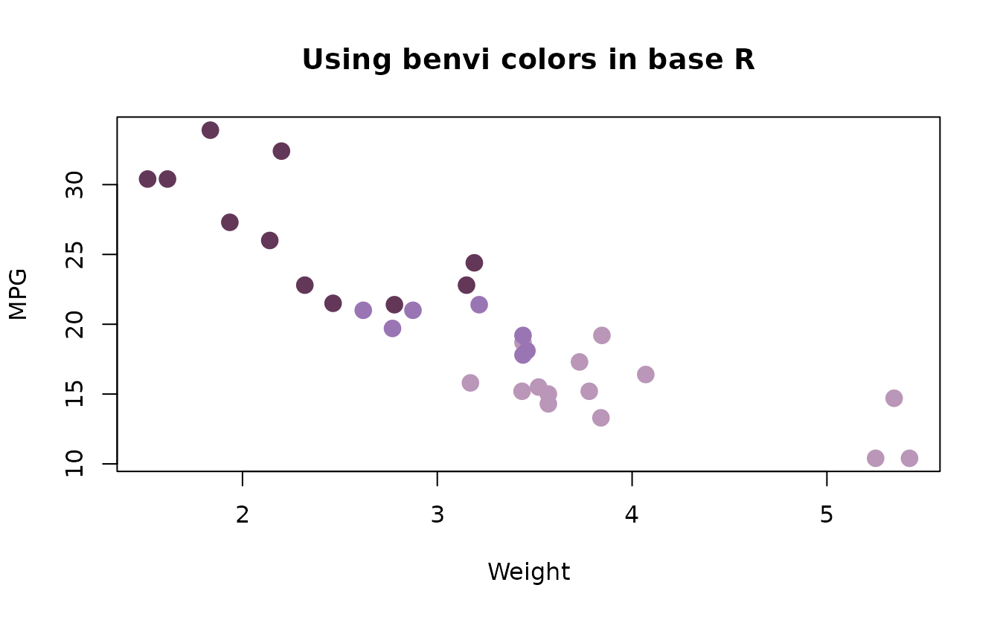

# Getting Started with benviplot

## Introduction

`benviplot` provides color palettes and ggplot2 helper functions
tailored for EDA. The color underlying color schemes are based on Benvi,
a discontinued brand of Brazilian proptech QuintoAndar. This package
uses publicly available color schemes for data visualization purposes.

## Installation

The easiest way to install `benviplot` currently is directly from
GitHub.

``` r
# Install remotes if needed
if (!requireNamespace("remotes", quietly = TRUE)) {
  install.packages("remotes")
}

# Install benviplot
remotes::install_github("viniciusoike/benviplot")
```

## Font Setup (Optional but Recommended)

`benviplot` uses the **Poppins** font family from Google Fonts.
Installing Poppins is **optional** - the theme will automatically fall
back to your system’s default font if Poppins isn’t available.

### One-Command Setup

Poppins is freely available at Google Fonts but you can also install it
with
[`setup_benvi_fonts()`](https://viniciusoike.github.io/benviplot/reference/setup_benvi_fonts.md).

``` r
library(benviplot)

# One-time setup - installs Poppins and configures graphics
setup_benvi_fonts()
```

This function additionally checks if `ragg` is installed and provides
guidance for RStudio configuration. If you’re running R from Positron,
no additional configuration is necessary.

## Quick Start

While the package can work with base R plots, the recommended use is
together with `ggplot2`.

``` r
library(ggplot2)
library(benviplot)
```

The basic usage of package is centered around the
[`theme_benvi()`](https://viniciusoike.github.io/benviplot/reference/theme_benvi.md)
and `scale_*` functions.

``` r
ggplot(mtcars, aes(x = wt, y = mpg, color = as.factor(cyl))) +
  geom_point(size = 3) +
  scale_color_benvi_d(name = "Cylinders", pal_name = "qual_8") +
  labs(
    title = "Fuel Efficiency vs. Weight",
    x = "Weight (1000 lbs)",
    y = "Miles per Gallon"
  ) +
  theme_benvi()
```



## Viewing Color Palettes

Before using a palette, you can preview it.

``` r
# View a qualitative palette
benvi_palette("qual_2")
```


``` r

# View a sequential palette
benvi_palette("benvi_blue")
```


``` r

# Get hex codes as character vector
colors <- as.character(benvi_palette("qual_2"))
```

## General Examples

### Bar Chart

For simple plots it’s easier to select colors using `benvi_palette` and
`theme_benvi`.

``` r
# Sample data
sales <- data.frame(
  cities = c(
    "São Paulo",
    "Rio de Janeiro",
    "Belo Horizonte",
    "Porto Alegre",
    "Curitiba"
  ),
  revenue = c(125, 200, 150, 175, 80)
)

ggplot(sales, aes(x = cities, y = revenue)) +
  geom_col(fill = benvi_palette("benvi_blue")[3], show.legend = FALSE) +
  geom_hline(yintercept = 0) +
  labs(
    title = "Revenue by Product",
    x = NULL,
    y = "Revenue ($1000s)"
  ) +
  theme_benvi() +
  theme(panel.grid.major.x = element_blank())
```



### Heatmap with Continuous Colors

Even though the Benvi palettes are discrete, applying them to a
continuous variable still works.

``` r
# Sample data - Texas housing
housing <- subset(txhousing, city %in% c("Austin", "Houston", "Dallas"))

ggplot(housing, aes(x = date, y = city, fill = log10(median))) +
  geom_tile() +
  scale_fill_benvi_c(
      pal_name = "benvi_blue",
      name = "Median\nPrice ($)",
      direction = -1) +
  labs(
    title = "Median House Prices in Texas Cities",
    x = "Year",
    y = NULL
  ) +
  theme_benvi()
```



## Using Plot Helper Functions

`benviplot` includes convenience functions for common plot types. These
save typing during exploratory data analysis. These functions come with
several changes to default `ggplot2` values. The first example shows a
simple line plot using the `economics` dataset.

``` r
plot_line(economics, x = date, y = uempmed)
```



The plot generated above is essentially a wrapper around other `ggplot2`
functions as arguments.

``` r
# Makes the same plot as the one above
ggplot(economics, aes(x = date, y = uempmed)) +
  geom_line(lwd = 1, color = benvi_palette("benvi_blue", 1)) +
  geom_hline(yintercept = 0) +
  labs(x = NULL) +
  theme_benvi()
```

The helper functions include several convenient arguments such as `text`
that add text labels on bar plots.

``` r
plot_column(sales, x = cities, y = revenue, text = TRUE)
```



These functions also support using aesthetics as grouping variables
under a generic `variable` alias.

``` r
plot_scatter(
  mtcars,
  x = wt,
  y = mpg,
  variable = as.factor(cyl),
  palette = "qual_8",
  scale_name = "Cylinders"
)
```



Finally, helper functions return `ggplot2` objects, so you can add
layers normally.

``` r
plot_line(economics, x = date, y = unemploy / 1000) +
  geom_smooth(se = FALSE, color = benvi_palette("oranges")[3]) +
  labs(
    title = "US Unemployment with Smoothed Trend",
    subtitle = "Unemployment figures in millions",
    x = "Year",
    y = "Unemployed (millions)",
    caption = "Data: economics dataset"
  )
```



### Can I use benvi colors in base R plots?

You can use benvi colors normally in base R plots. However, replicating
`ggplot2` functionality might be challenging.

``` r
colors <- as.character(benvi_palette("purples"))

plot(
  mtcars$wt,
  mtcars$mpg,
  col = colors[mtcars$cyl / 2 - 1],
  pch = 19,
  cex = 1.5,
  xlab = "Weight",
  ylab = "MPG",
  main = "Using benvi colors in base R"
)
```



## Next Steps

1.  **Explore all palettes**: See
    [`vignette("color-palettes")`](https://viniciusoike.github.io/benviplot/articles/color-palettes.md)
    for complete gallery.
2.  **Learn plot functions**: Check
    [`vignette("plot-functions")`](https://viniciusoike.github.io/benviplot/articles/plot-functions.md)
    for detailed examples.
3.  **Customize themes**: Read
    [`vignette("themes-and-styling")`](https://viniciusoike.github.io/benviplot/articles/themes-and-styling.md)
    for advanced styling.

## Getting Help

- **Function documentation**:
  [`?benvi_palette`](https://viniciusoike.github.io/benviplot/reference/benvi_palette.md),
  [`?scale_color_benvi_d`](https://viniciusoike.github.io/benviplot/reference/ggplot2-scales-discrete.md),
  etc.
- **Package website**: <https://viniciusoike.github.io/benviplot/>
- **Report issues**: <https://github.com/viniciusoike/benviplot/issues>
- **Ask questions**: Open a GitHub discussion.

Happy plotting!
