# Plot Helper Functions

``` r
library(ggplot2)
library(benviplot)
```

## Introduction

`benviplot` provides convenience functions for creating common chart
types. These functions simplify the plotting process while maintaining
full ggplot2 compatibility, making them perfect for:

- **Data exploration**: Quickly visualize patterns
- **Reports**: Reduce code repetition
- **Prototyping**: Test different visualizations rapidly

All plot functions return standard ggplot2 objects, so you can add
layers, modify themes, and customize freely.

## Common Parameters

Most plot functions share these parameters:

| Parameter     | Description                     | Default                                                           |
|---------------|---------------------------------|-------------------------------------------------------------------|
| `data`        | A data.frame or tibble          | Required                                                          |
| `x`           | Variable for x-axis             | Required                                                          |
| `y`           | Variable for y-axis             | Required                                                          |
| `variable`    | Grouping variable for colors    | Optional                                                          |
| `palette`     | Palette name (e.g., “qual_5”)   | Function-specific                                                 |
| `scale_name`  | Legend title                    | `""`                                                              |
| `scale_label` | Legend labels                   | [`waiver()`](https://ggplot2.tidyverse.org/reference/waiver.html) |
| `color`       | Single color (when no grouping) | Auto                                                              |

## plot_line()

Create line charts for time series and trends.

### Basic Usage

``` r
# Simple line chart - rental price index
plot_line(iqa, x = date, y = index)
```

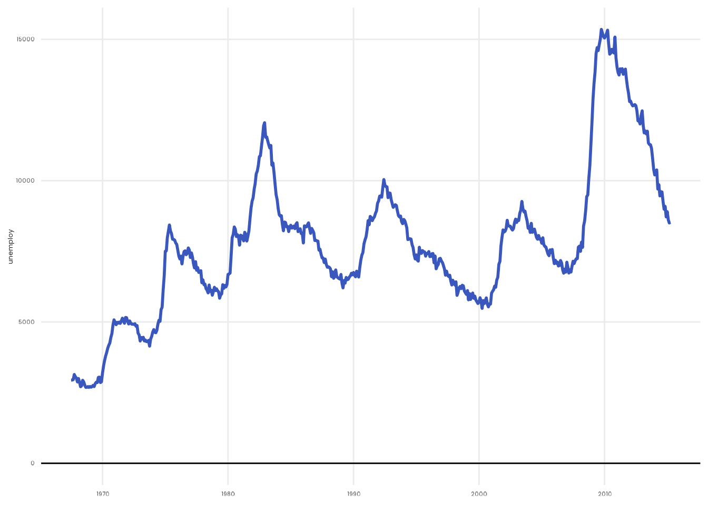

### Multiple Lines

``` r
# Filter for demonstration
index_subset <- subset(
  iqaiw,
  rooms == "Total" & name_muni %in% c("São Paulo", "Rio de Janeiro", "Belo Horizonte")
)

plot_line(
  index_subset,
  x = date,
  y = index,
  variable = name_muni,
  pal_name = "qual_benvi",
  scale_name = "City"
)
```

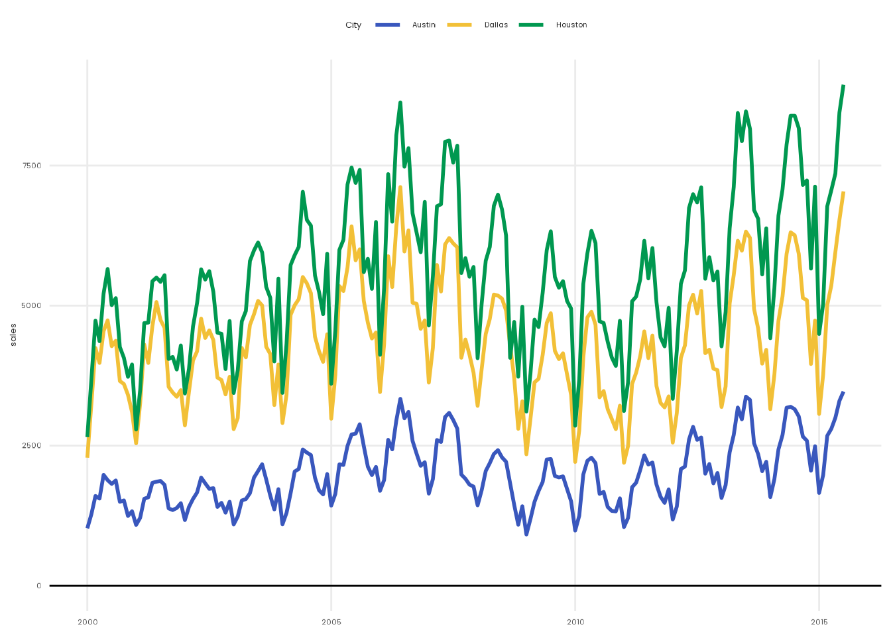

### With Points

``` r
# Sample data
monthly_sales <- data.frame(
  month = 1:12,
  revenue = c(120, 135, 145, 142, 158, 165, 170, 168, 175, 180, 190, 195)
)

plot_line(monthly_sales, x = month, y = revenue, point = TRUE)
```

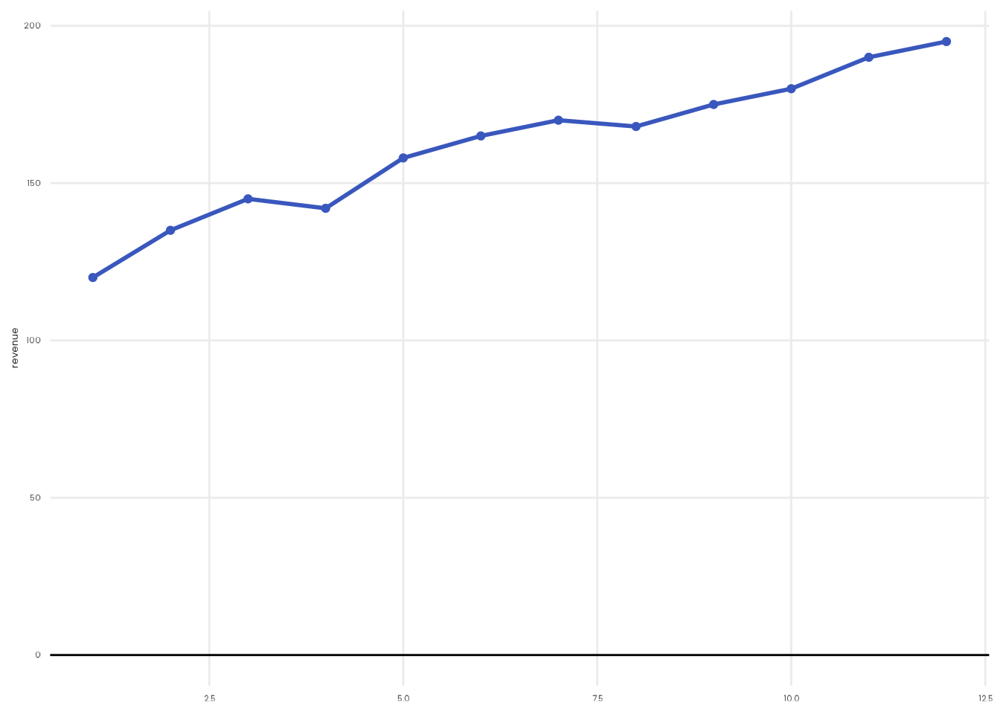

### Key Parameters

- `point`: Add points on the line (`TRUE`/`FALSE`)
- `zero`: Draw y = 0 reference line (`TRUE`/`FALSE`)
- `color`: Custom color for single lines

## plot_column()

Create bar/column charts for categorical comparisons.

### Basic Bar Chart

``` r
# Sample data
products <- data.frame(
  product = c("A", "B", "C", "D", "E"),
  sales = c(120, 200, 150, 180, 220)
)

plot_column(products, x = product, y = sales)
```

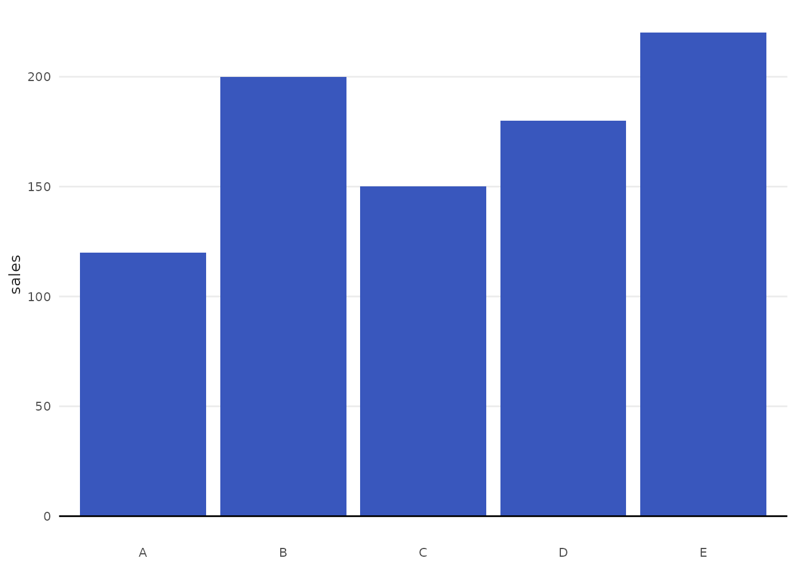

### With Value Labels

``` r
# Show values on bars
plot_column(products, x = product, y = sales, text = TRUE)
```

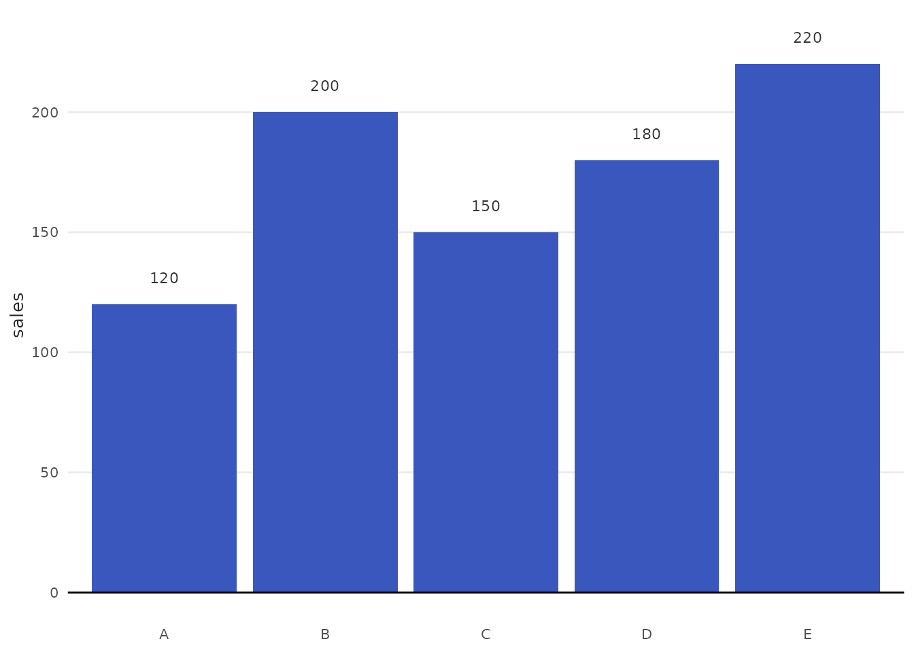

### Grouped Bars

``` r
# Data with groups
quarterly <- data.frame(
  quarter = rep(c("Q1", "Q2", "Q3", "Q4"), each = 3),
  region = rep(c("North", "South", "West"), 4),
  revenue = c(120, 130, 115, 145, 155, 140, 160, 165, 150, 175, 180, 170)
)

plot_column(
  quarterly,
  x = quarter,
  y = revenue,
  variable = region,
  palette = "greens",
  scale_name = "Region"
)
```

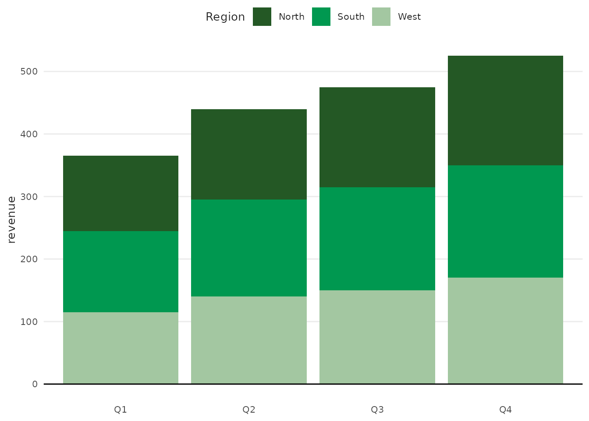

### Key Parameters

- `text`: Show value labels on bars (`TRUE`/`FALSE`)
- `variable`: Create grouped/stacked bars
- `horizontal`: Flip to horizontal bars (`TRUE`/`FALSE`)

## plot_scatter()

Create scatter plots to visualize relationships between variables.

### Basic Scatter

``` r
# Listing vs contract prices
spo_latest <- subset(sales_report, name_muni == "São Paulo" & date == max(date))
plot_scatter(spo_latest, x = price_m2_listing, y = price_m2_contract)
```

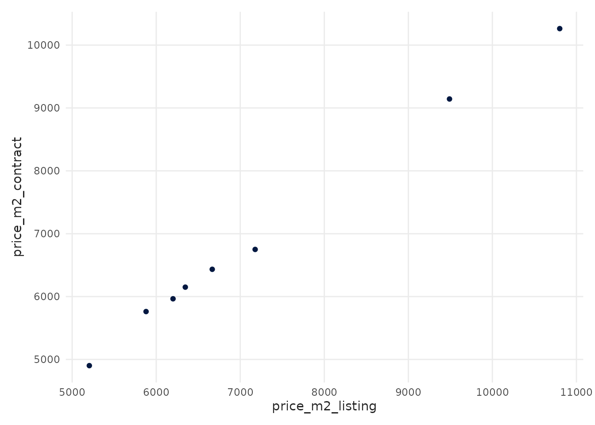

### With Groups

``` r
# Compare listing vs contract by city
latest_sales <- subset(sales_report, date == max(date))
plot_scatter(
  latest_sales,
  x = price_m2_listing,
  y = price_m2_contract,
  variable = name_muni,
  palette = "qual_benvi",
  scale_name = "City"
)
```

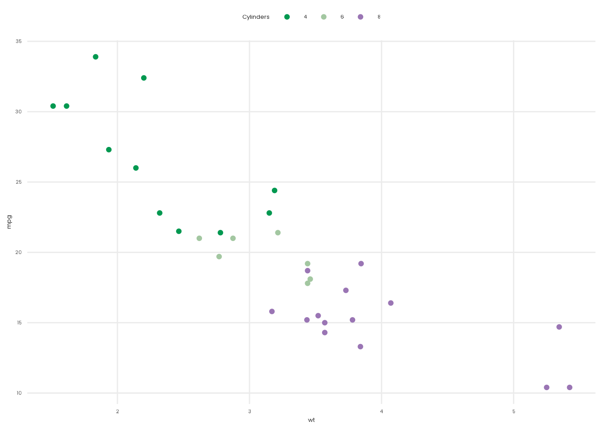

### With Trend Line

``` r
plot_scatter(
  spo_latest,
  x = price_m2_listing,
  y = price_m2_contract,
  fit = TRUE,
  fit_method = "lm"
)
```

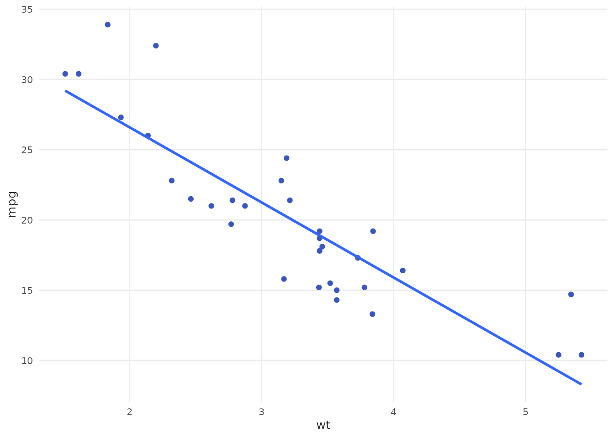

### Grouped Trend Lines

``` r
plot_scatter(
  latest_sales,
  x = price_m2_listing,
  y = price_m2_contract,
  variable = name_muni,
  fit = TRUE,
  fit_variable = TRUE,
  fit_method = "lm",
  palette = "qual_benvi",
  scale_name = "City"
)
```

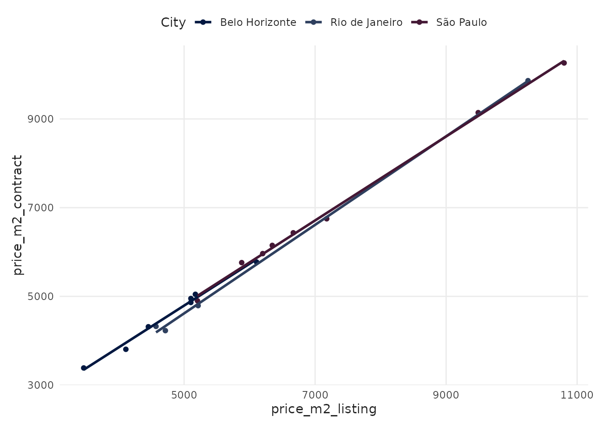

### With Axis Lines

``` r
# Create sample data with negative values
scatter_data <- data.frame(
  x = rnorm(50, 0, 2),
  y = rnorm(50, 0, 2)
)

plot_scatter(scatter_data, x = x, y = y, zero = "both")
```

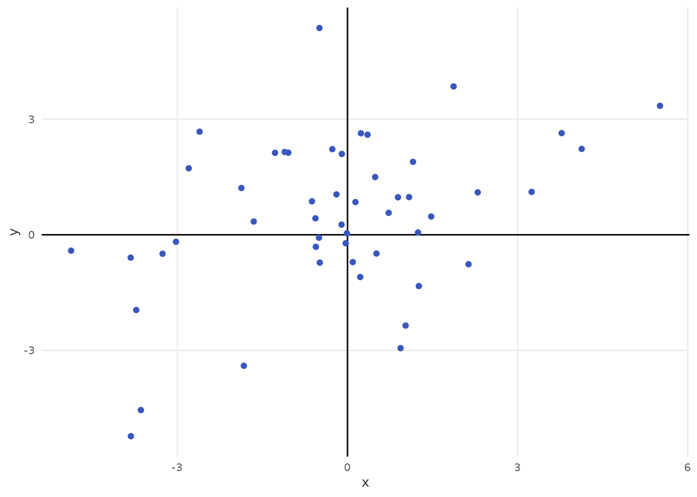

### Key Parameters

- `fit`: Add trend line (`TRUE`/`FALSE`)
- `fit_method`: Method for trend line (`"lm"`, `"loess"`, `"auto"`)
- `fit_variable`: Separate trend lines per group (`TRUE`/`FALSE`)
- `fit_ci`: Show confidence interval (`TRUE`/`FALSE`)
- `zero`: Add axis lines (`"none"`, `"x"`, `"y"`, `"both"`)

## plot_area()

Create area charts for showing cumulative values or proportions.

### Basic Area Chart

``` r
# Rental price index over time
plot_area(iqa, x = date, y = index) +
  labs(y = "Index (base = 100)")
```

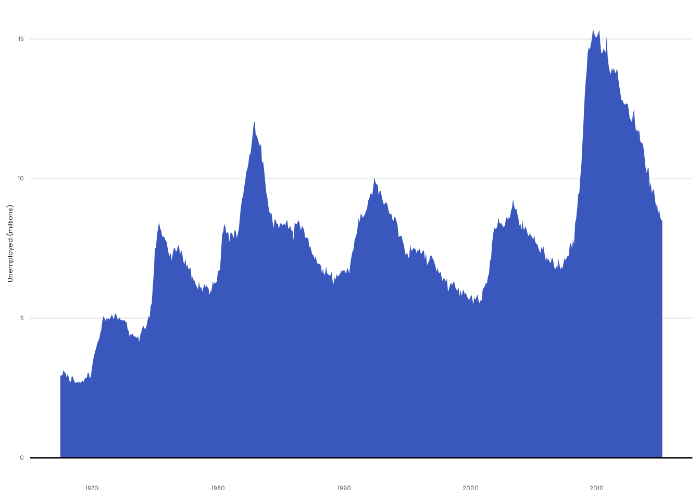

### Stacked Area

``` r
# Sample data
time_series <- data.frame(
  year = rep(2010:2020, 3),
  category = rep(c("Product A", "Product B", "Product C"), each = 11),
  value = c(
    seq(100, 150, length.out = 11),
    seq(80, 120, length.out = 11),
    seq(60, 100, length.out = 11)
  )
)

plot_area(
  time_series,
  x = year,
  y = value,
  variable = category,
  palette = "seq_greens",
  scale_name = "Product"
)
```

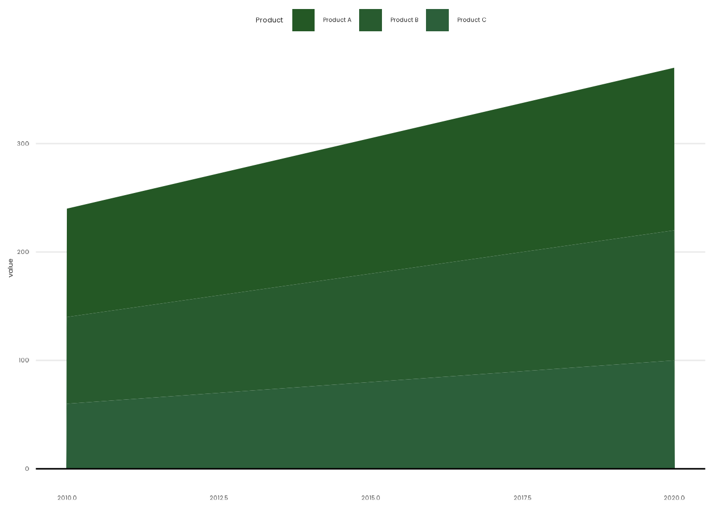

### Key Parameters

- `variable`: Create stacked areas
- `palette`: Color palette for multiple areas

## plot_histogram()

Create histograms to visualize distributions.

### Basic Histogram

``` r
# Distribution of rental prices per m2
iqaiw_total <- subset(iqaiw, rooms == "Total")
plot_histogram(iqaiw_total, x = price_m2)
```

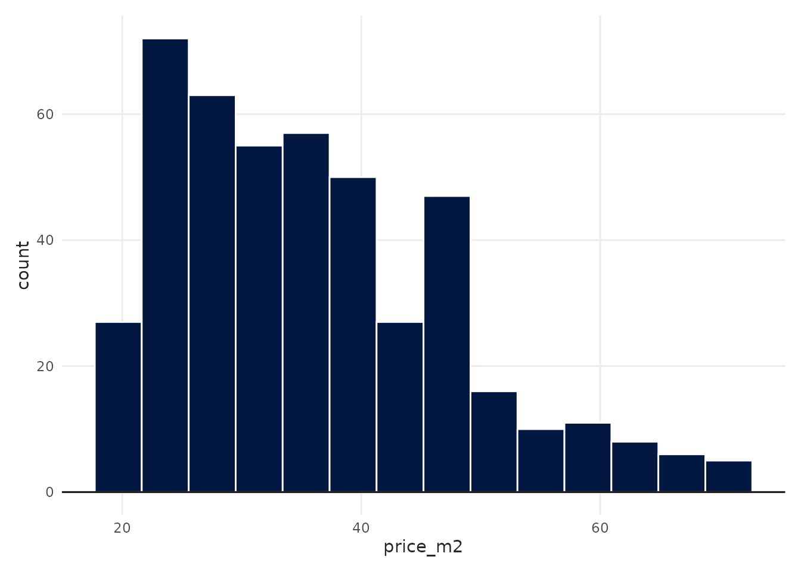

### With Custom Bins

``` r
plot_histogram(iqaiw_total, x = price_m2, bins = 20)
```

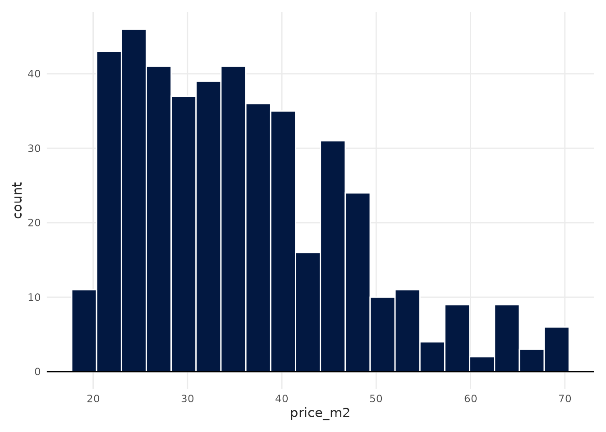

### With Faceting

``` r
# Distribution by city (using faceting is clearer than stacking for histograms)
plot_histogram(
  iqaiw_total,
  x = price_m2,
  facet = name_muni,
  ncol = 3
) +
  labs(subtitle = "Rental price distribution by city")
```

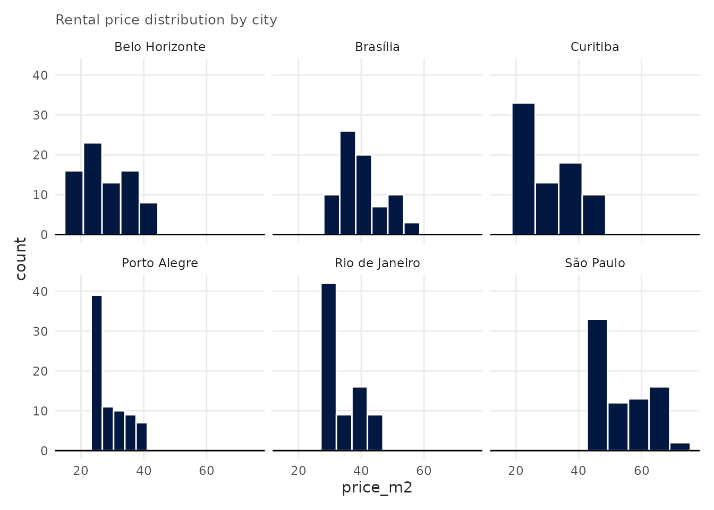

### Different Binning Methods

``` r
# Using Freedman-Diaconis rule
plot_histogram(iqaiw_total, x = price_m2, method = "fd") +
  labs(subtitle = "Freedman-Diaconis binwidth")
```

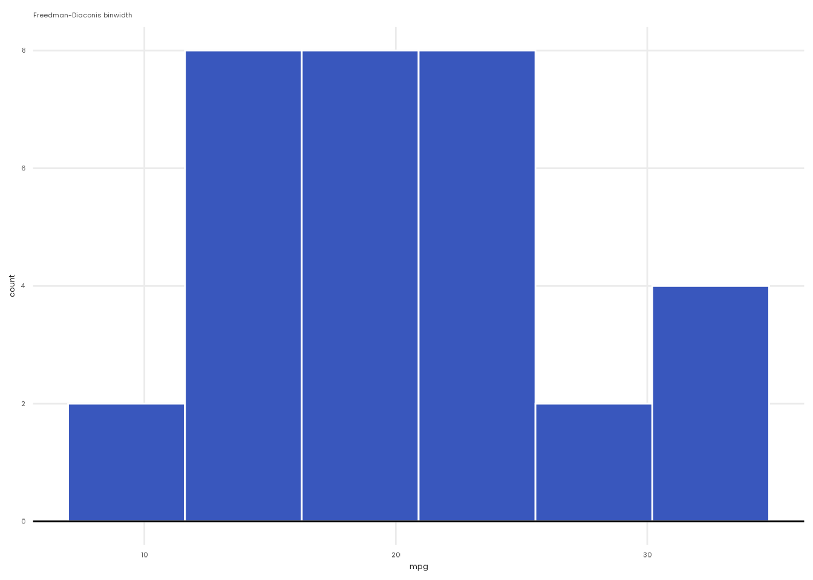

### Key Parameters

- `bins`: Number of bins (integer)
- `bw`: Binwidth calculation method (`"sturges"`, `"fd"`, `"scott"`)
- `variable`: Group by category
- `position`: Histogram style (`"stack"`, `"dodge"`, `"identity"`)

## Advanced Examples

### Combining Multiple Layers

All plot functions return ggplot objects, so you can add layers:

``` r
plot_line(iqa, x = date, y = index) +
  geom_smooth(
    method = "loess",
    se = FALSE,
    color = benvi_palette("benvi_purple")[3],
    linewidth = 1.5
  ) +
  labs(
    title = "Rio de Janeiro Rental Price Index",
    subtitle = "With smoothed trend line",
    x = "Year",
    y = "Index (base = 100)"
  )
```

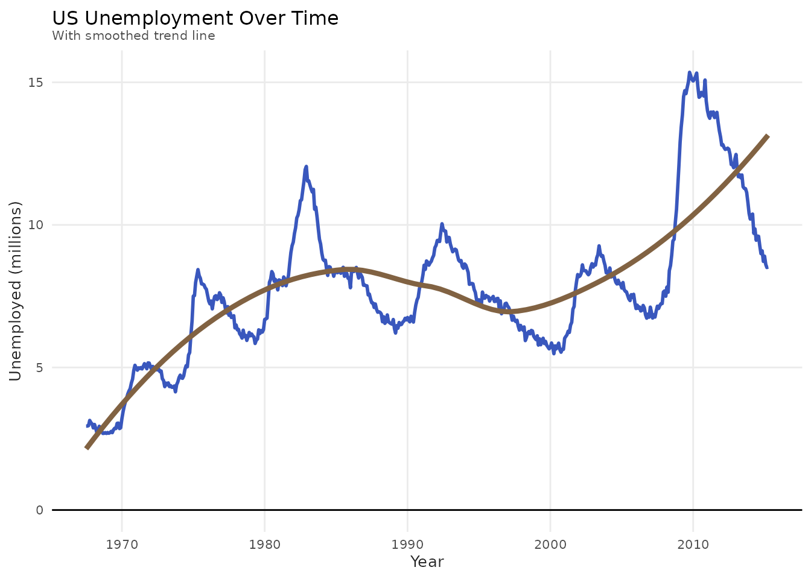

### Customizing Aesthetics

``` r
plot_scatter(
  latest_sales,
  x = price_m2_listing,
  y = price_m2_contract,
  variable = name_muni,
  palette = "qual_benvi",
  scale_name = "City",
  size = 4,  # Passed to geom_point via ...
  alpha = 0.7
) +
  labs(
    title = "Listing vs Contract Prices by City",
    subtitle = "Custom size and transparency",
    x = "Listing Price (R$/m²)",
    y = "Contract Price (R$/m²)"
  )
```

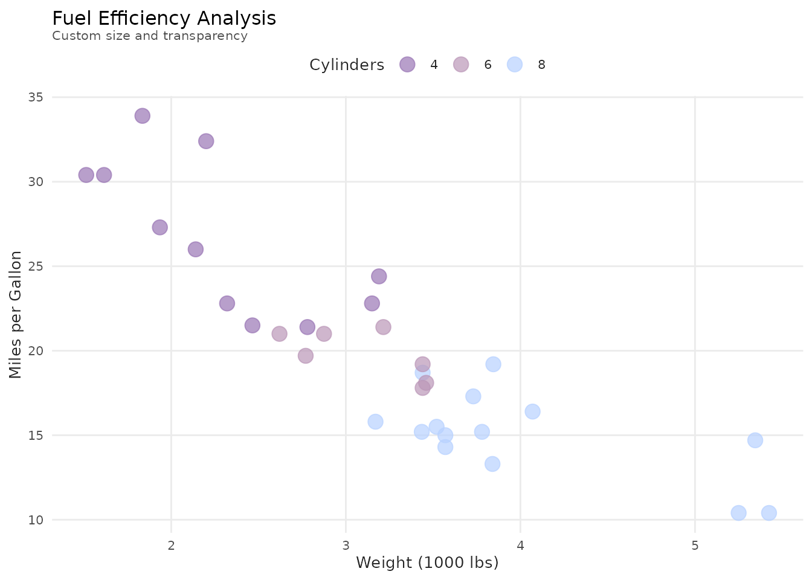

### Faceting

``` r
plot_scatter(latest_sales, x = price_m2_listing, y = price_m2_contract) +
  facet_wrap(~ name_muni) +
  labs(title = "Listing vs Contract Prices by City")
```

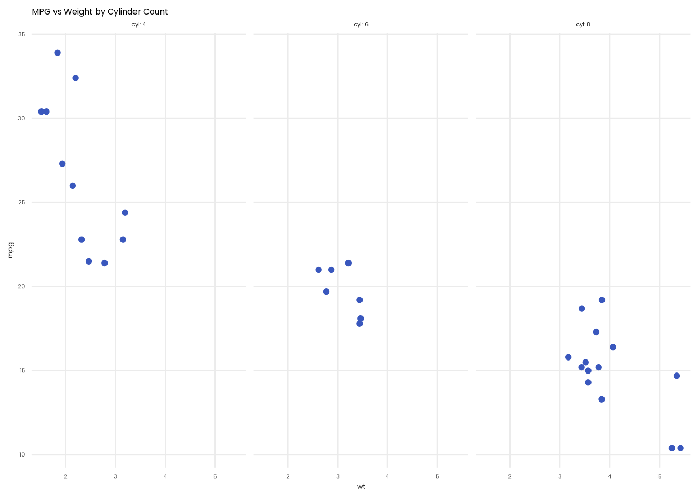

### Combining Helper Functions with Manual ggplot2

``` r
# Start with helper function, then customize extensively
plot_column(products, x = product, y = sales) +
  geom_hline(
    yintercept = mean(products$sales),
    linetype = "dashed",
    color = "gray40",
    linewidth = 1
  ) +
  annotate(
    "text",
    x = 1,
    y = mean(products$sales) + 10,
    label = "Average",
    hjust = 0,
    color = "gray40"
  ) +
  labs(
    title = "Product Sales vs Average",
    y = "Sales ($1000s)"
  )
```

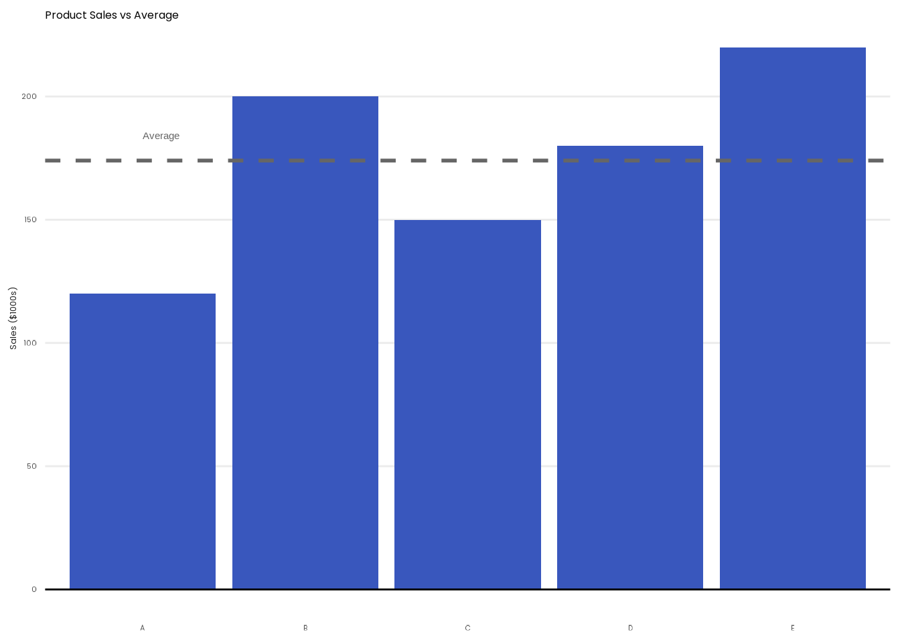

## When to Use Helper Functions vs. Pure ggplot2

### Use Helper Functions When:

- [x] Doing quick exploratory analysis
- [x] Creating standard charts repeatedly
- [x] Writing reports with consistent styling
- [x] Teaching/prototyping

### Use Pure ggplot2 When:

- [x] Creating complex, custom visualizations
- [x] Need precise control over every element
- [x] Building unique chart types
- [x] Combining multiple geometries in unusual ways

**Remember**: Helper functions are just shortcuts. You can always start
with a helper and customize with ggplot2 layers!

## Customization Examples

### Custom Colors Without `variable`

``` r
# Use specific benvi color
my_color <- benvi_palette("benvi_blue")[3]

plot_line(iqa, x = date, y = index, color = my_color) +
  labs(title = "Custom Color Line Chart")
```

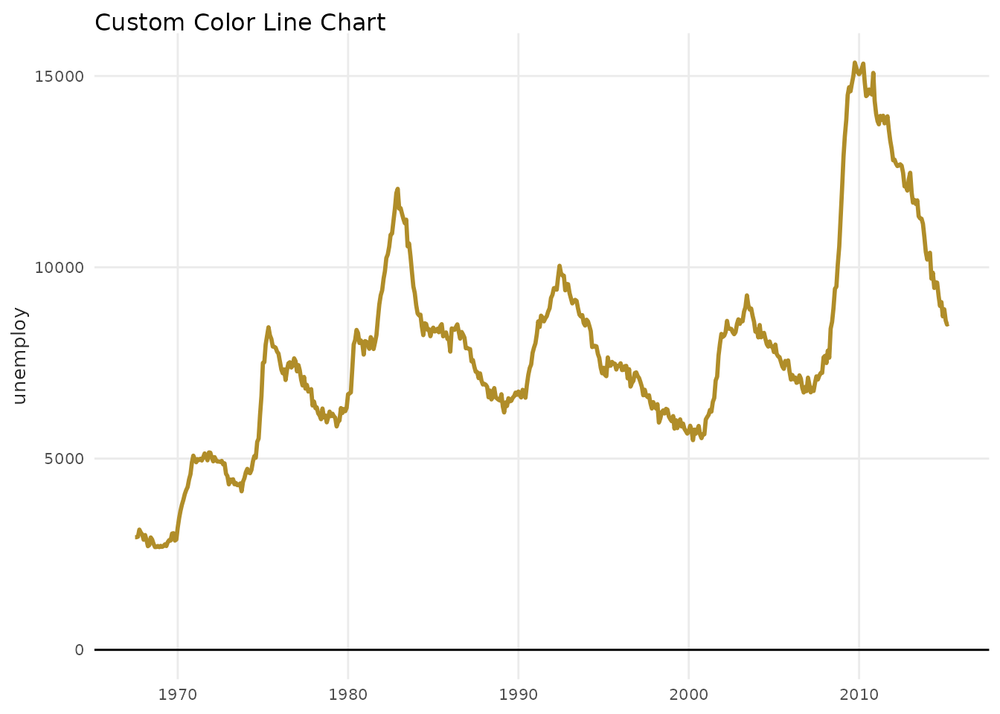

### Custom Legend

``` r
plot_scatter(
  latest_sales,
  x = price_m2_listing,
  y = price_m2_contract,
  variable = name_muni,
  palette = "purples",
  scale_name = "City",
  scale_label = c("BH", "RJ", "SP")
) +
  theme(legend.position = "bottom")
```

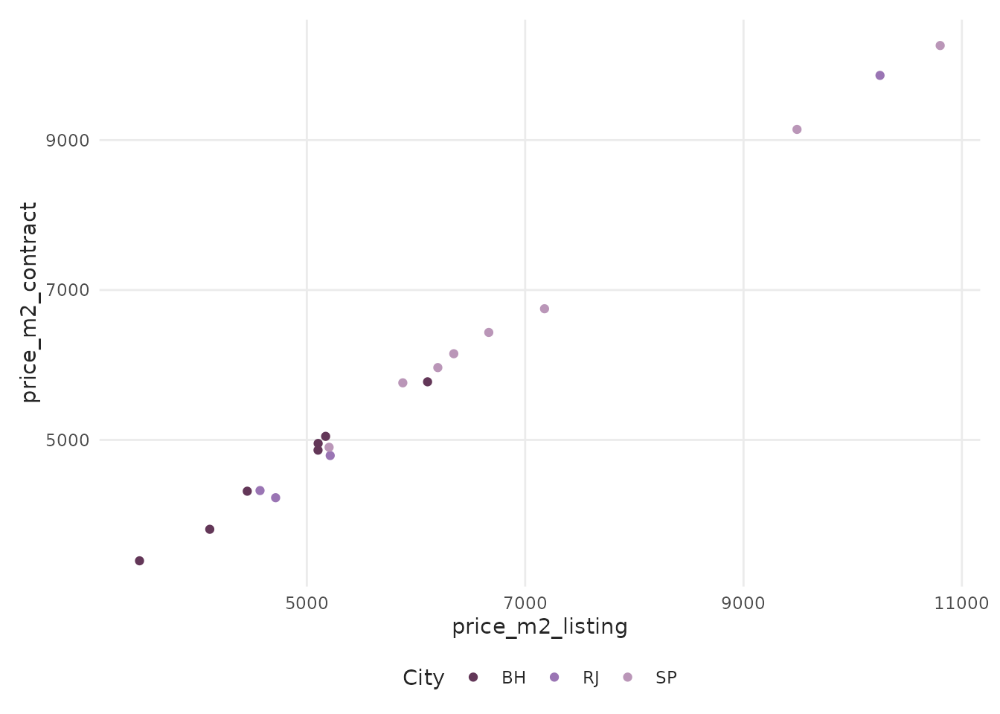

### Adding Titles and Labels

``` r
plot_column(products, x = product, y = sales, text = TRUE) +
  labs(
    title = "Q4 Product Sales Performance",
    subtitle = "All regions combined",
    x = "Product Category",
    y = "Revenue ($1000s)",
    caption = "Source: Internal sales data"
  )
```

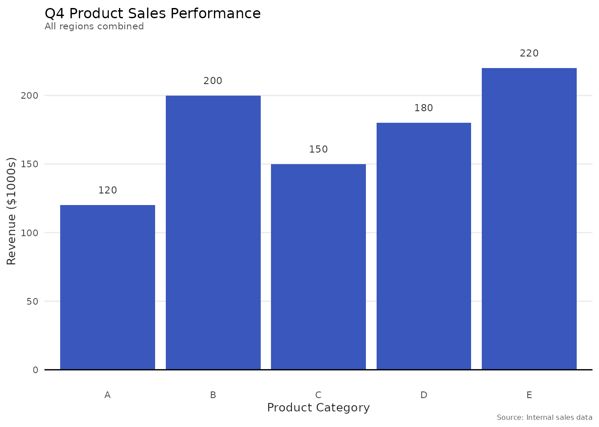

## Tips and Best Practices

### 1. Choose Appropriate Chart Types

- **Trends over time**:
  [`plot_line()`](https://viniciusoike.github.io/benviplot/reference/plot_line.md)
  or
  [`plot_area()`](https://viniciusoike.github.io/benviplot/reference/plot_area.md)
- **Comparing categories**:
  [`plot_column()`](https://viniciusoike.github.io/benviplot/reference/plot_column.md)
- **Relationships**:
  [`plot_scatter()`](https://viniciusoike.github.io/benviplot/reference/plot_scatter.md)
- **Distributions**:
  [`plot_histogram()`](https://viniciusoike.github.io/benviplot/reference/plot_histogram.md)

### 2. Limit Colors

When using `variable`, keep groups ≤ 7 for readability:

``` r
# Good: 2 groups
index_few <- subset(index_subset, name_muni %in% c("São Paulo", "Rio de Janeiro"))
plot_line(index_few, x = date, y = index, variable = name_muni, pal_name = "yellows")
```

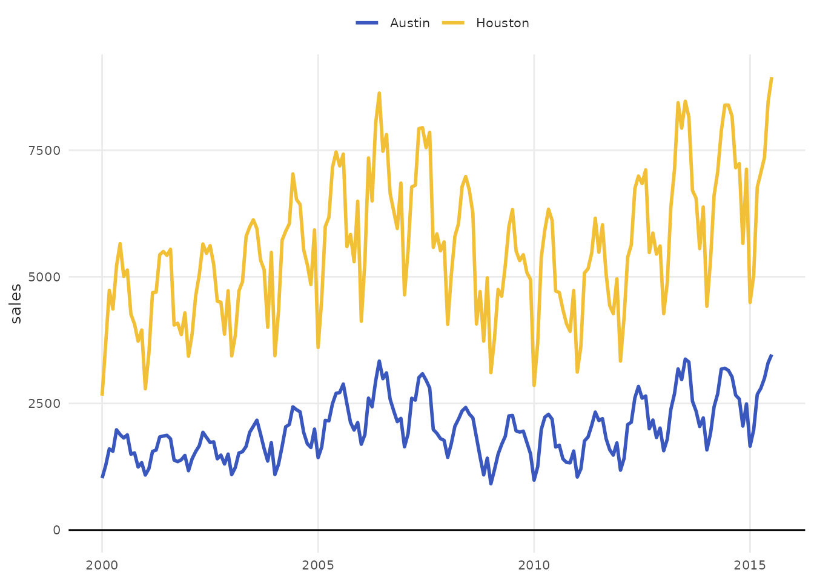

### 3. Use Appropriate Palettes

- **Categorical groups**: Use `Qual*` or `Set*` palettes
- **Sequential/ordered**: Use `Seq*` palettes

### 4. Always Label Your Axes

``` r
plot_scatter(spo_latest, x = price_m2_listing, y = price_m2_contract) +
  labs(
    x = "Listing Price (R$/m²)",
    y = "Contract Price (R$/m²)"
  )
```

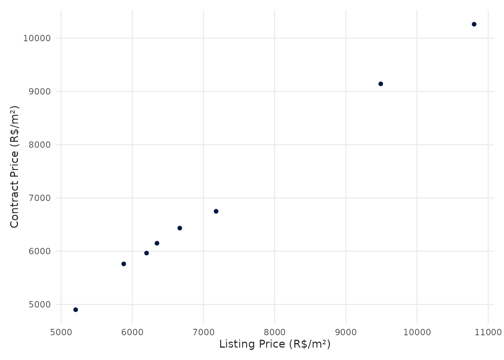

### 5. Consider Your Audience

- **Presentations**: Larger text, fewer details
- **Reports**: More annotations, context
- **Exploration**: Quick and simple

## Function Reference Summary

| Function                                                                                   | Best For             | Key Feature              |
|--------------------------------------------------------------------------------------------|----------------------|--------------------------|
| [`plot_line()`](https://viniciusoike.github.io/benviplot/reference/plot_line.md)           | Time series, trends  | `point` parameter        |
| [`plot_column()`](https://viniciusoike.github.io/benviplot/reference/plot_column.md)       | Category comparisons | `text` labels            |
| [`plot_scatter()`](https://viniciusoike.github.io/benviplot/reference/plot_scatter.md)     | Correlations         | `fit` trend lines        |
| [`plot_area()`](https://viniciusoike.github.io/benviplot/reference/plot_area.md)           | Cumulative values    | Stacked areas            |
| [`plot_histogram()`](https://viniciusoike.github.io/benviplot/reference/plot_histogram.md) | Distributions        | Multiple binning methods |

## Troubleshooting

### “Object not found” errors

Ensure you’re using unquoted column names:

``` r
# Correct
plot_line(data, x = date, y = value)

# Incorrect
plot_line(data, x = "date", y = "value")
```

### Colors not showing

When using `variable`, ensure it’s a factor or categorical:

``` r
# Ensure categorical variables are factors if needed
plot_scatter(
  latest_sales,
  x = price_m2_listing,
  y = price_m2_contract,
  variable = name_muni,  # Already character/factor
  palette = "qual_benvi"
)
```

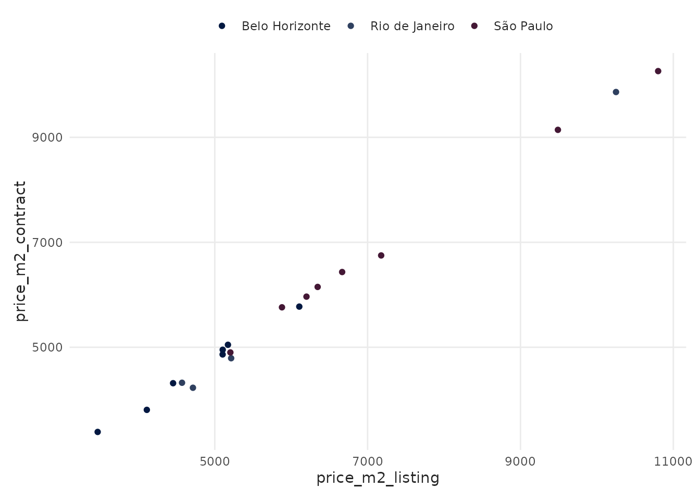

### Palette errors

Check that palette exists and has enough colors:

``` r
# View available colors
benvi_palette("qual_5")

# Ensure you don't exceed available colors for discrete palettes
```

## Summary

In this vignette you learned:

- [x] How to use all plot helper functions
- [x] Common parameters across functions
- [x] When to use helpers vs. pure ggplot2
- [x] How to customize and extend helper plots
- [x] Best practices for effective visualizations

## Next Steps

- See
  [`vignette("color-palettes")`](https://viniciusoike.github.io/benviplot/articles/color-palettes.md)
  for complete palette gallery
- See
  [`vignette("themes-and-styling")`](https://viniciusoike.github.io/benviplot/articles/themes-and-styling.md)
  for theme customization
- Explore individual function documentation:
  [`?plot_line`](https://viniciusoike.github.io/benviplot/reference/plot_line.md),
  [`?plot_scatter`](https://viniciusoike.github.io/benviplot/reference/plot_scatter.md),
  etc.

## Further Examples

For more visualization ideas and techniques:

- [R Graph Gallery](https://r-graph-gallery.com/)
- [ggplot2 Book](https://ggplot2-book.org/)
- [Data Visualization with R](https://rkabacoff.github.io/datavis/)
