# Themes and Styling

``` r

library(ggplot2)
library(benviplot)
```

## Introduction

Visual consistency is key to professional data visualization. This
vignette shows you how to use and customize
[`theme_benvi()`](https://viniciusoike.github.io/benviplot/reference/theme_benvi.md)
to create polished, publication-ready graphics.

## The theme_benvi() Theme

[`theme_benvi()`](https://viniciusoike.github.io/benviplot/reference/theme_benvi.md)
provides a clean, modern aesthetic designed for clarity and readability:

- **Clean background**: White with minimal gridlines
- **Professional typography**: Poppins font family
- **Smart defaults**: Legend on top, appropriate text sizes
- **Flexible**: Easy to customize

### Basic Usage

Simply add
[`theme_benvi()`](https://viniciusoike.github.io/benviplot/reference/theme_benvi.md)
to any ggplot:

``` r

ggplot(mtcars, aes(x = wt, y = mpg)) +
  geom_point(color = benvi_palette("purples")[1], size = 3) +
  labs(
    title = "Fuel Efficiency vs. Weight",
    subtitle = "Using theme_benvi()",
    x = "Weight (1000 lbs)",
    y = "Miles per Gallon"
  ) +
  theme_benvi()
```

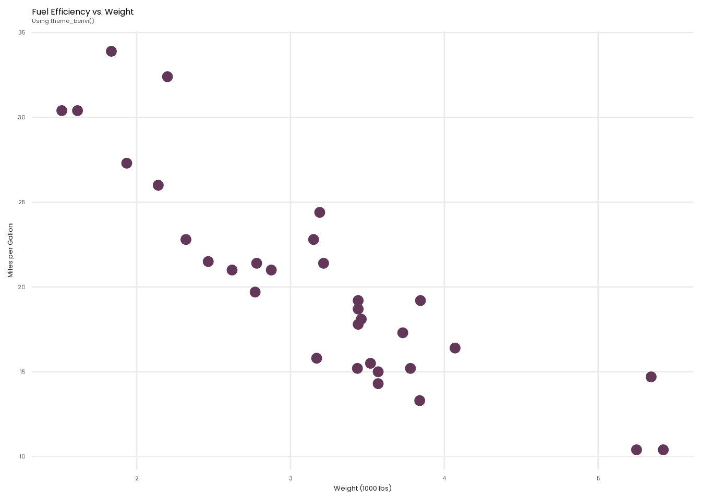

### Comparing with Default Theme

``` r

# Create base plot
p <- ggplot(mtcars, aes(x = wt, y = mpg, color = as.factor(cyl))) +
  geom_point(size = 3) +
  scale_color_benvi_d(pal_name = "qual_5", name = "Cylinders") +
  labs(
    title = "Fuel Efficiency Analysis",
    x = "Weight (1000 lbs)",
    y = "Miles per Gallon"
  )

# Default ggplot2 theme
p1 <- p + labs(subtitle = "Default theme_gray()") + theme_gray()

# benvi theme
p2 <- p + labs(subtitle = "theme_benvi()") + theme_benvi()

# Display side by side (requires patchwork or gridExtra)
# For vignette, we'll show separately
p1
```

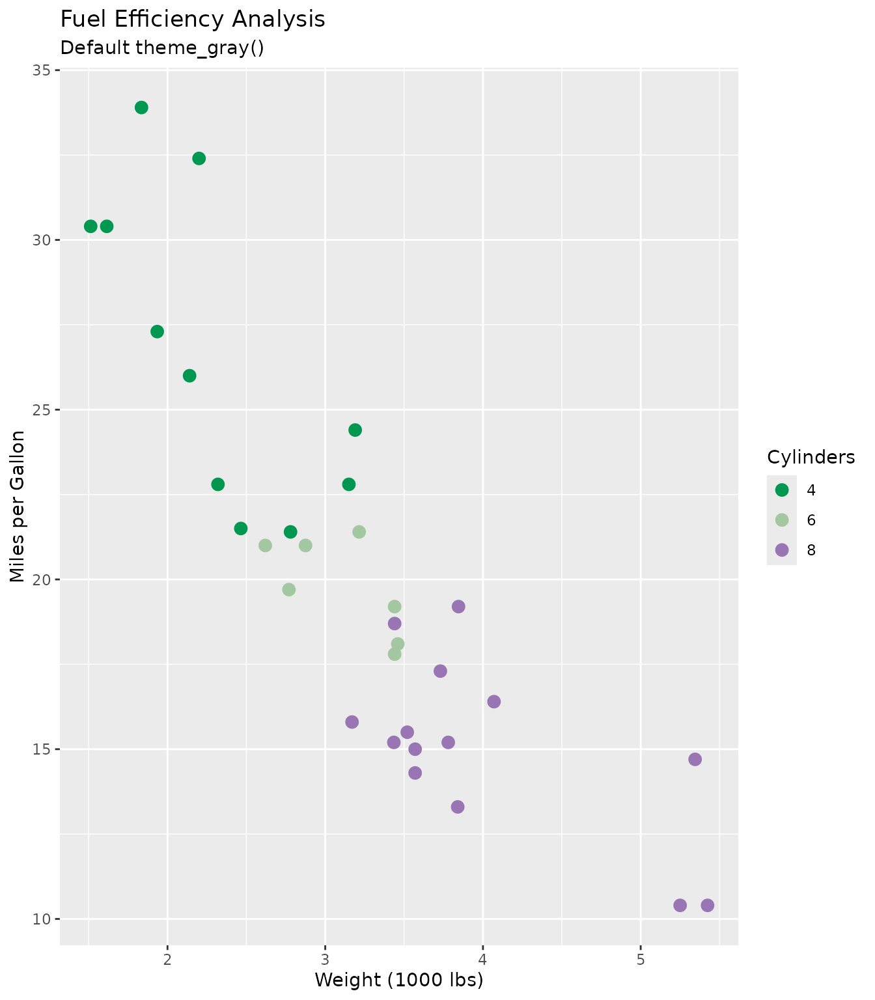

``` r

p2
```

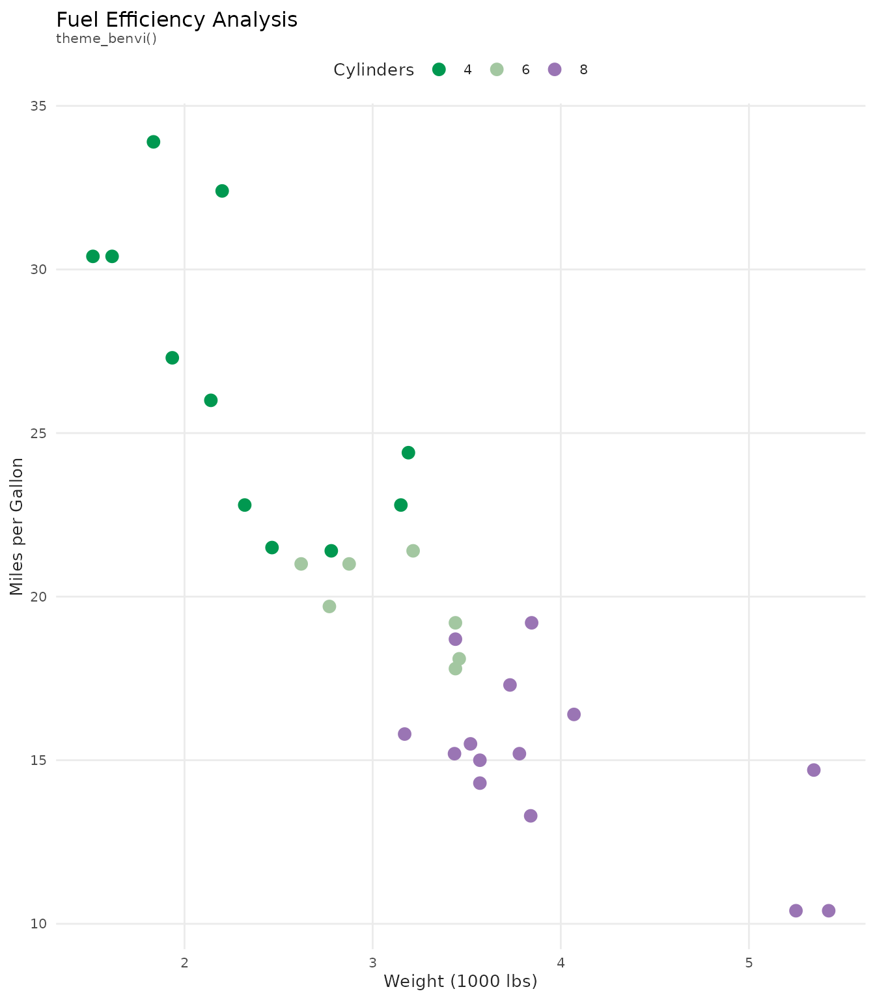

## Theme Components

### Typography

[`theme_benvi()`](https://viniciusoike.github.io/benviplot/reference/theme_benvi.md)
uses the **Poppins** font with carefully chosen sizes:

- **Title**: 12pt, black
- **Subtitle**: 8pt, dark gray
- **Body text**: 10pt, dark gray
- **Caption**: 6pt, dark gray

``` r

ggplot(economics, aes(x = date, y = unemploy / 1000)) +
  geom_line(color = benvi_palette("browns")[1], linewidth = 1) +
  labs(
    title = "Title: Clear and Prominent",
    subtitle = "Subtitle: Provides additional context",
    x = "X-axis label",
    y = "Y-axis label",
    caption = "Caption: Source information or notes"
  ) +
  theme_benvi()
```

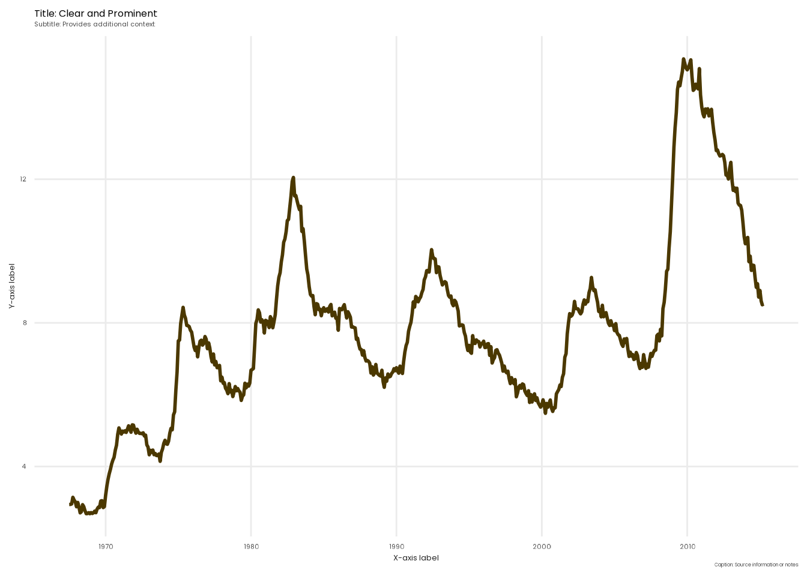

### Grid Lines

Only major grid lines are shown for cleaner appearance:

``` r

# With theme_benvi (major grid only)
ggplot(mtcars, aes(x = factor(cyl), y = mpg)) +
  geom_boxplot(fill = benvi_palette("greens")[1]) +
  labs(title = "Clean Grid: Major Lines Only") +
  theme_benvi()
```

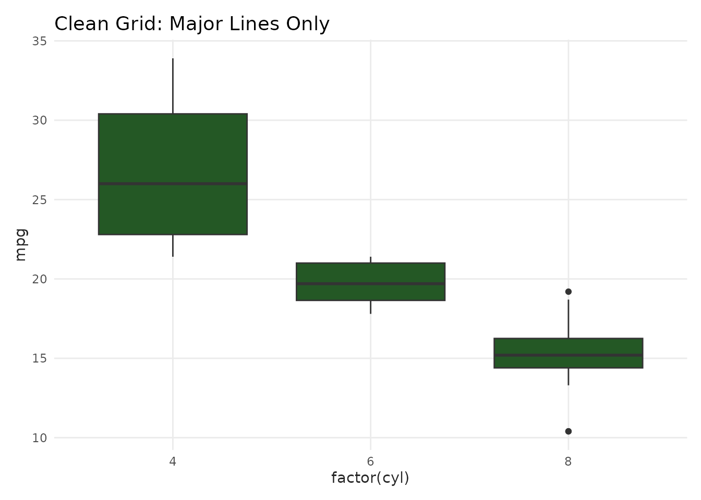

### Legend Position

Default legend position is on top for better readability:

``` r

ggplot(mtcars, aes(x = wt, y = mpg, color = as.factor(cyl))) +
  geom_point(size = 3) +
  scale_color_benvi_d(pal_name = "purples", name = "Cylinders") +
  labs(title = "Legend on Top (Default)") +
  theme_benvi()
```

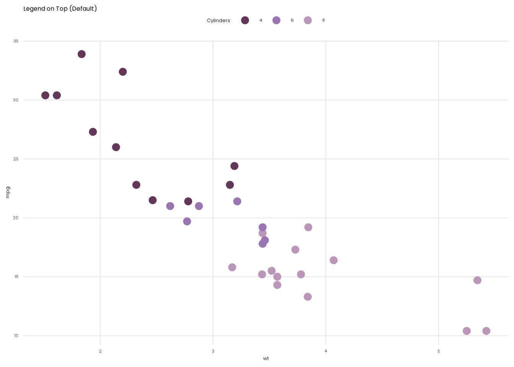

## Font Management

### Modern Font System (v1.1.0+)

`benviplot` uses a modern font system based on systemfonts. Fonts are
installed to your system once and work across all R sessions.

### One-Time Font Setup

Install Poppins font to your system:

``` r

# Recommended: Complete setup in one command
setup_benvi_fonts()

# Or install just the font
install_poppins()
```

**That’s it!** The font is now available system-wide and will work in
all R sessions.

### Automatic Fallback

If Poppins isn’t installed,
[`theme_benvi()`](https://viniciusoike.github.io/benviplot/reference/theme_benvi.md)
automatically falls back to your system’s default font. You’ll see a
one-time message suggesting installation:

``` r

# Works even without Poppins installed
ggplot(mtcars, aes(wt, mpg)) +
  geom_point() +
  theme_benvi()
#> ℹ Poppins font not found. Using system default font instead.
#> ℹ Install Poppins with: benviplot::install_poppins()
```

### Check Font Status

Verify your font setup:

``` r

# Check if Poppins is installed
check_poppins_installed()

# Get full status report
font_status()
```

### Using Other Fonts

Override the default font family with
[`theme()`](https://ggplot2.tidyverse.org/reference/theme.html):

``` r

ggplot(mtcars, aes(wt, mpg)) +
  geom_point() +
  theme_benvi() +
  theme(text = element_text(family = "Roboto"))
```

### For Best Results: Install ragg

For optimal text rendering quality:

``` r

install.packages("ragg")

# Then configure RStudio:
# Tools > Global Options > General > Graphics > Backend: AGG
```

See
[`vignette("font-setup")`](https://viniciusoike.github.io/benviplot/articles/font-setup.md)
for detailed instructions and troubleshooting.

## Customizing theme_benvi()

[`theme_benvi()`](https://viniciusoike.github.io/benviplot/reference/theme_benvi.md)
is a starting point. Customize it with additional
[`theme()`](https://ggplot2.tidyverse.org/reference/theme.html) calls:

### Change Legend Position

``` r

ggplot(mtcars, aes(x = wt, y = mpg, color = as.factor(cyl))) +
  geom_point(size = 3) +
  scale_color_benvi_d(pal_name = "oranges", name = "Cylinders") +
  labs(title = "Legend on Right") +
  theme_benvi() +
  theme(legend.position = "right")
```

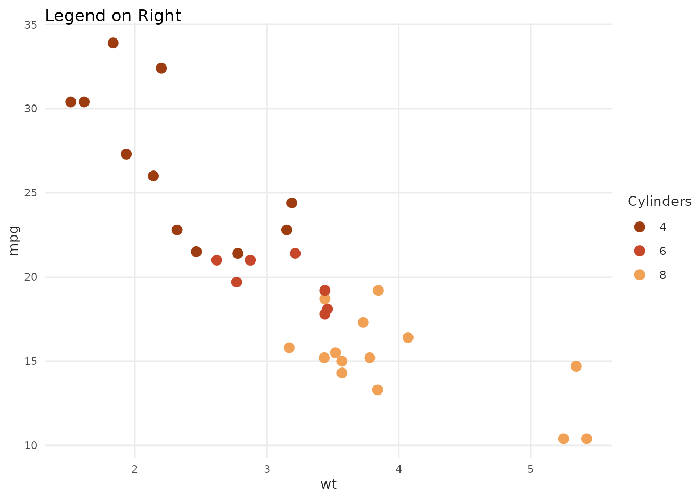

### Adjust Text Sizes

``` r

ggplot(mtcars, aes(x = wt, y = mpg)) +
  geom_point(color = benvi_palette("yellows")[1], size = 3) +
  labs(
    title = "Larger Text for Presentations",
    x = "Weight",
    y = "MPG"
  ) +
  theme_benvi() +
  theme(
    plot.title = element_text(size = 16),
    axis.title = element_text(size = 12),
    axis.text = element_text(size = 10)
  )
```

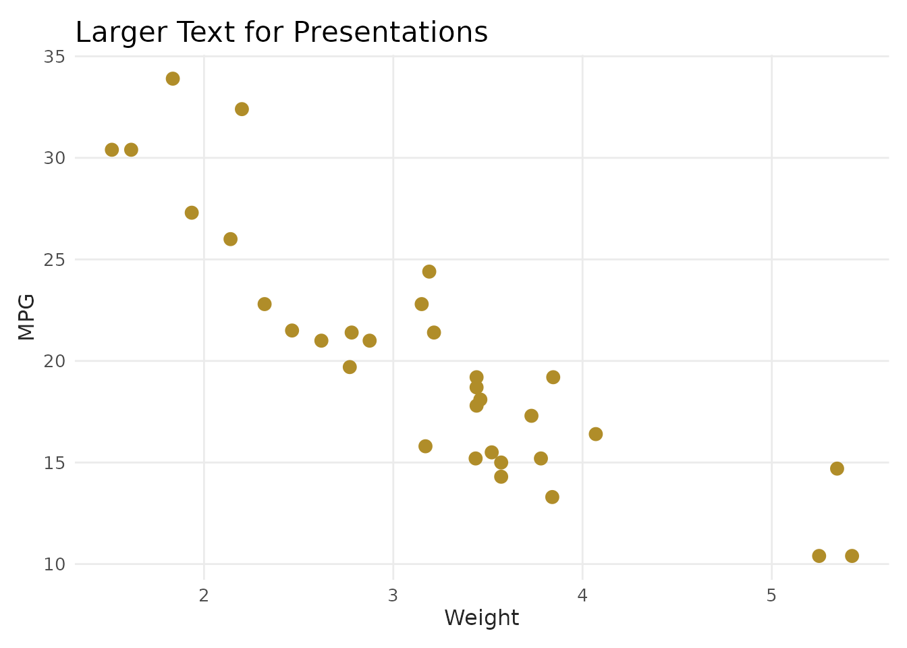

### Rotate Axis Labels

``` r

products <- data.frame(
  product = c("Product A", "Product B", "Product C", "Product D"),
  sales = c(120, 200, 150, 180)
)

ggplot(products, aes(x = product, y = sales)) +
  geom_col(fill = benvi_palette("blues")[1]) +
  labs(title = "Rotated X-Axis Labels") +
  theme_benvi() +
  theme(axis.text.x = element_text(angle = 45, hjust = 1))
```

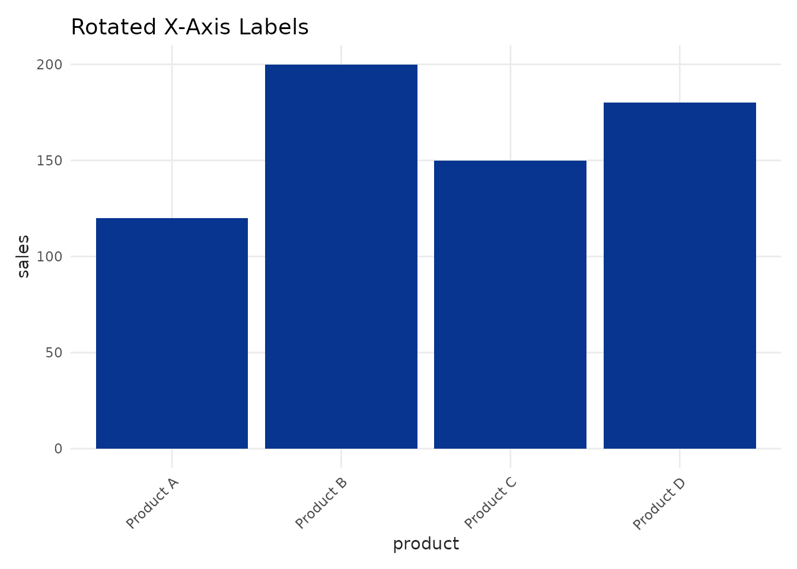

### Remove Grid Lines

``` r

ggplot(mtcars, aes(x = wt, y = mpg)) +
  geom_point(color = benvi_palette("rio_qual")[1], size = 3) +
  labs(title = "No Grid Lines") +
  theme_benvi() +
  theme(
    panel.grid.major = element_blank(),
    panel.grid.minor = element_blank()
  )
```

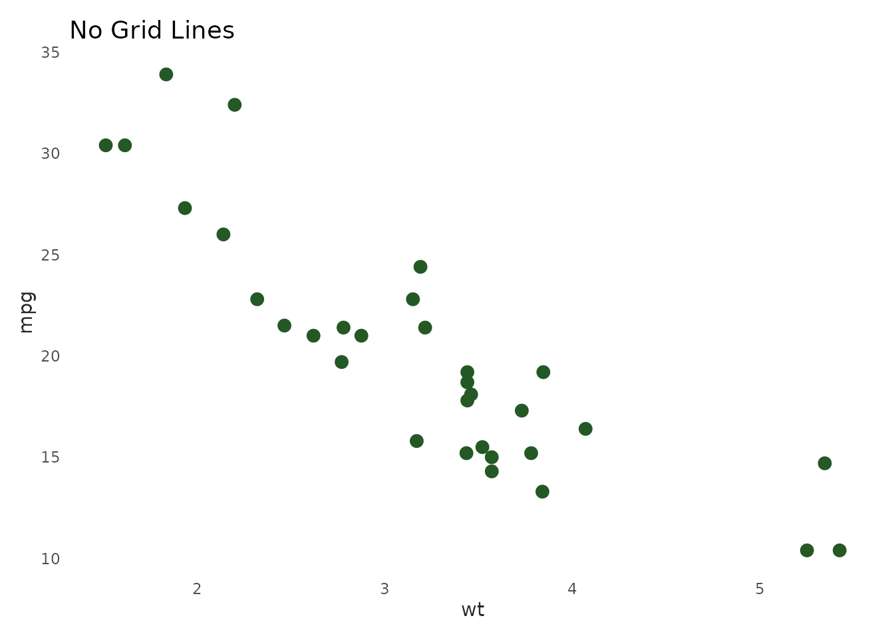

### Add Background Color

``` r

ggplot(economics, aes(x = date, y = unemploy)) +
  geom_area(fill = benvi_palette("seq_purples")[5], alpha = 0.7) +
  labs(title = "Custom Background Color") +
  theme_benvi() +
  theme(
    plot.background = element_rect(fill = "#f5f5f5"),
    panel.background = element_rect(fill = "#ffffff")
  )
```

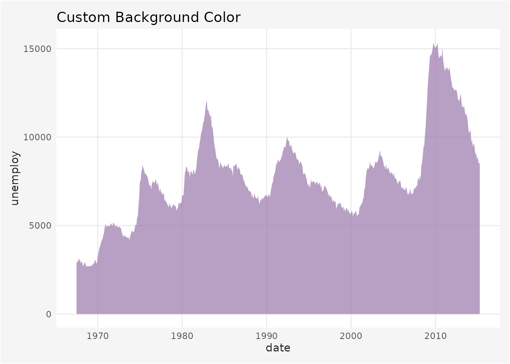

## Creating Publication-Ready Plots

### Elements of a Publication Plot

1.  **Clear title and subtitle**
2.  **Labeled axes with units**
3.  **Data source in caption**
4.  **Appropriate color palette**
5.  **Legend (if needed)**
6.  **Clean, minimal design**

``` r

# Sample data
housing_subset <- txhousing |>
  dplyr::filter(city %in% c("Austin", "Houston", "Dallas"))

# Publication-ready plot
ggplot(housing_subset, aes(x = date, y = median / 1000, color = city)) +
  geom_line(linewidth = 1.2) +
  scale_color_benvi_d(
    pal_name = "purples",
    name = "City"
  ) +
  labs(
    title = "Median Home Prices in Major Texas Cities",
    subtitle = "2000-2015",
    x = "Year",
    y = "Median Price ($1000s)",
    caption = "Source: Texas A&M Real Estate Center"
  ) +
  theme_benvi() +
  theme(
    plot.title = element_text(size = 14, face = "bold"),
    legend.position = "bottom"
  )
```

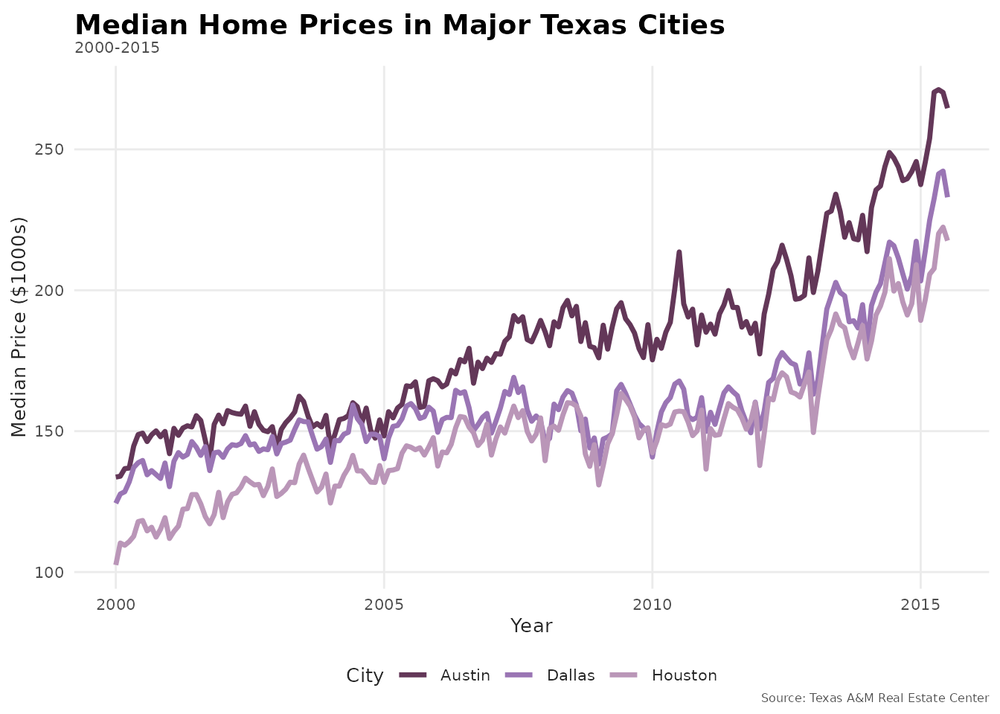

### Faceted Plot

``` r

ggplot(mtcars, aes(x = wt, y = mpg)) +
  geom_point(color = benvi_palette("qual_5")[1], size = 2) +
  geom_smooth(
    method = "lm",
    se = FALSE,
    color = benvi_palette("qual_5")[2]
  ) +
  facet_wrap(~ cyl, labeller = label_both) +
  labs(
    title = "Fuel Efficiency by Cylinder Count",
    subtitle = "Linear regression fits shown",
    x = "Weight (1000 lbs)",
    y = "Miles per Gallon",
    caption = "Data: mtcars dataset"
  ) +
  theme_benvi() +
  theme(
    strip.text = element_text(size = 10, face = "bold")
  )
```

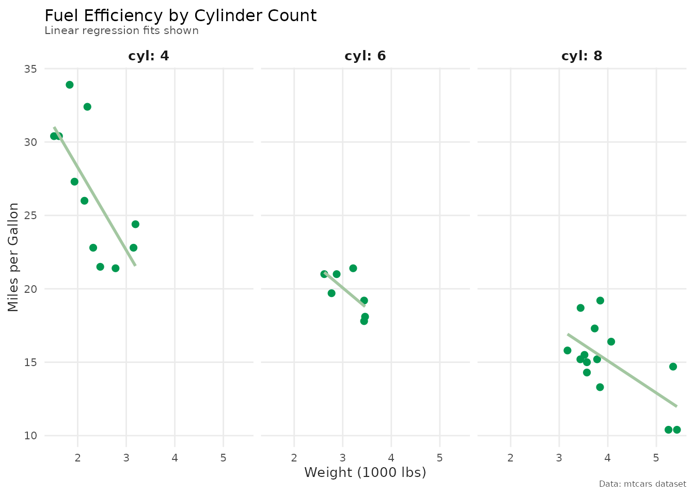

## Advanced Customization

### Creating a Custom Theme

Build on
[`theme_benvi()`](https://viniciusoike.github.io/benviplot/reference/theme_benvi.md)
to create your own theme:

``` r

# Define custom theme
theme_presentation <- function() {
  theme_benvi() +
    theme(
      # Larger text for visibility
      text = element_text(size = 14),
      plot.title = element_text(size = 18, face = "bold"),
      plot.subtitle = element_text(size = 14),
      axis.title = element_text(size = 14),
      axis.text = element_text(size = 12),

      # Legend
      legend.text = element_text(size = 12),
      legend.title = element_text(size = 12, face = "bold"),
      legend.position = "bottom",

      # More spacing
      plot.margin = margin(20, 20, 20, 20)
    )
}

# Use custom theme
ggplot(mtcars, aes(x = wt, y = mpg, color = as.factor(cyl))) +
  geom_point(size = 4) +
  scale_color_benvi_d(pal_name = "purples", name = "Cylinders") +
  labs(
    title = "Presentation-Sized Plot",
    subtitle = "Larger text for readability"
  ) +
  theme_presentation()
```

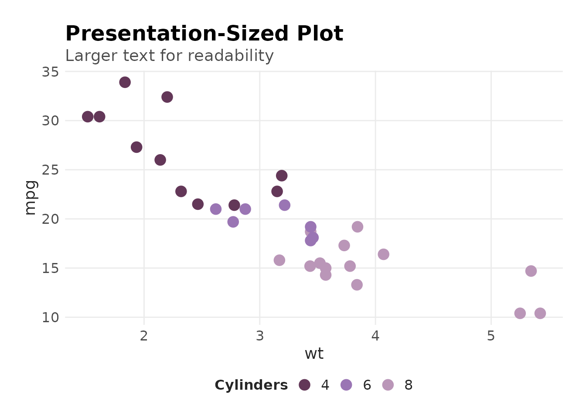

### Theme for Reports

``` r

theme_report <- function() {
  theme_benvi() +
    theme(
      # Smaller, compact
      text = element_text(size = 9),
      plot.title = element_text(size = 11),
      plot.subtitle = element_text(size = 9),

      # No legend title to save space
      legend.title = element_blank(),
      legend.position = "top",

      # Tight margins
      plot.margin = margin(5, 5, 5, 5)
    )
}

# Use in report
ggplot(economics, aes(x = date, y = uempmed)) +
  geom_line(color = benvi_palette("browns")[1]) +
  labs(
    title = "Median Unemployment Duration",
    caption = "Source: FRED"
  ) +
  theme_report()
```

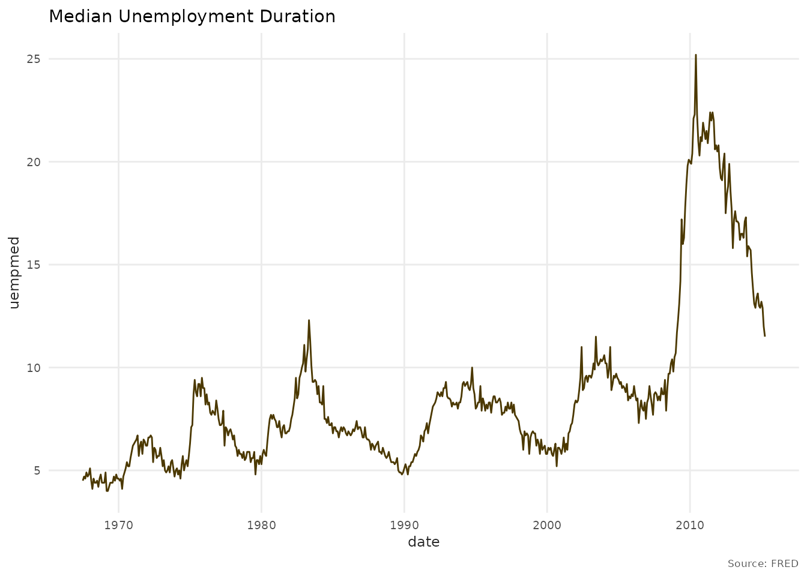

## Combining Themes with Scales

Always use benvi scales with benvi theme for consistency:

``` r

ggplot(mtcars, aes(x = factor(cyl), y = mpg, fill = factor(cyl))) +
  geom_boxplot(show.legend = FALSE) +
  scale_fill_benvi_d(pal_name = "pinks") +  # benvi scale
  labs(
    title = "MPG Distribution by Cylinders",
    x = "Number of Cylinders",
    y = "Miles per Gallon"
  ) +
  theme_benvi()  # benvi theme
```

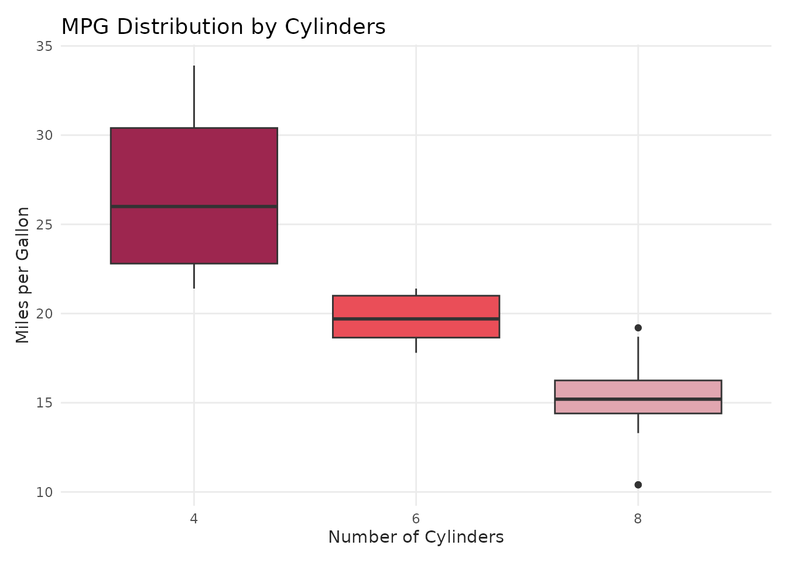

## Saving Plots

### Recommended: Use ggsave_benvi()

`benviplot` provides
[`ggsave_benvi()`](https://viniciusoike.github.io/benviplot/reference/ggsave_benvi.md)
which automatically uses the ragg graphics device for high-quality
output:

``` r

p <- ggplot(mtcars, aes(x = wt, y = mpg)) +
  geom_point(color = benvi_palette("purples")[1], size = 3) +
  labs(title = "Fuel Efficiency") +
  theme_benvi()

# Recommended: Uses ragg automatically for PNG
ggsave_benvi("plot.png", p)

# PDF (vector graphics)
ggsave_benvi("plot.pdf", p, width = 7, height = 5)
```

**Benefits of ggsave_benvi():** - Automatically uses ragg device for PNG
files (better quality, no font issues) - Smart defaults (300 DPI, 7x5
inches) - Consistent output across platforms

### For Print

``` r

# High-resolution for publication
ggsave_benvi("plot.png", p, width = 7, height = 5)
```

### For Presentations

``` r

# Larger size for slides
ggsave_benvi("slide.png", p, width = 10, height = 6)
```

### For Web

``` r

# Standard web resolution
ggsave_benvi("web_plot.png", p, width = 8, height = 5)
```

### Using Standard ggsave()

You can still use regular
[`ggsave()`](https://ggplot2.tidyverse.org/reference/ggsave.html) if
preferred:

``` r

ggsave("plot.png", p, width = 7, height = 5, dpi = 300)
```

## Accessibility Tips

### Color Considerations

``` r

# Use patterns in addition to colors
ggplot(mtcars, aes(x = factor(cyl), y = mpg, fill = factor(cyl))) +
  geom_violin(show.legend = FALSE) +
  scale_fill_benvi_d(pal_name = "purples") +
  labs(
    title = "Distribution Shape Helps Convey Information",
    subtitle = "Don't rely solely on color",
    x = "Cylinders"
  ) +
  theme_benvi()
```

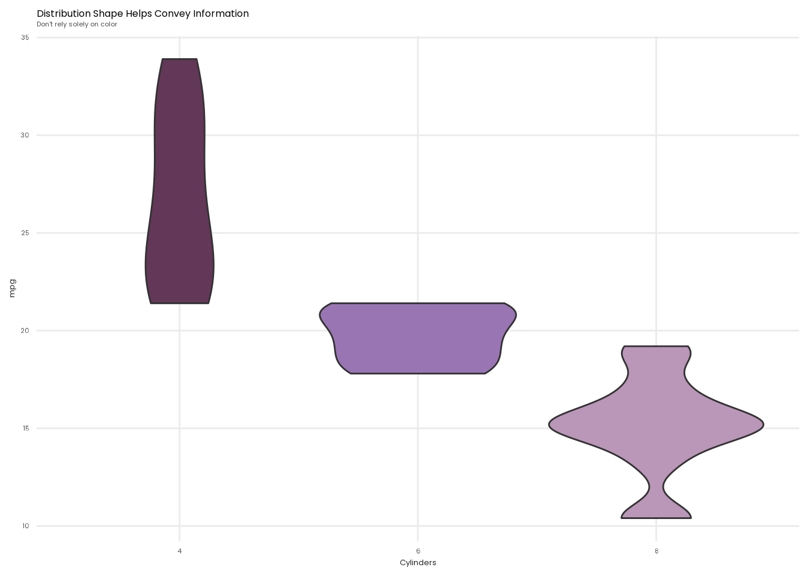

### Sufficient Contrast

Ensure text is readable:

``` r

# Good contrast between text and background
ggplot(mtcars, aes(x = wt, y = mpg)) +
  geom_point(size = 3, color = benvi_palette("browns")[1]) +
  labs(
    title = "Clear, High-Contrast Text",
    x = "Weight",
    y = "MPG"
  ) +
  theme_benvi() +
  theme(
    plot.background = element_rect(fill = "white"),
    text = element_text(color = "black")
  )
```

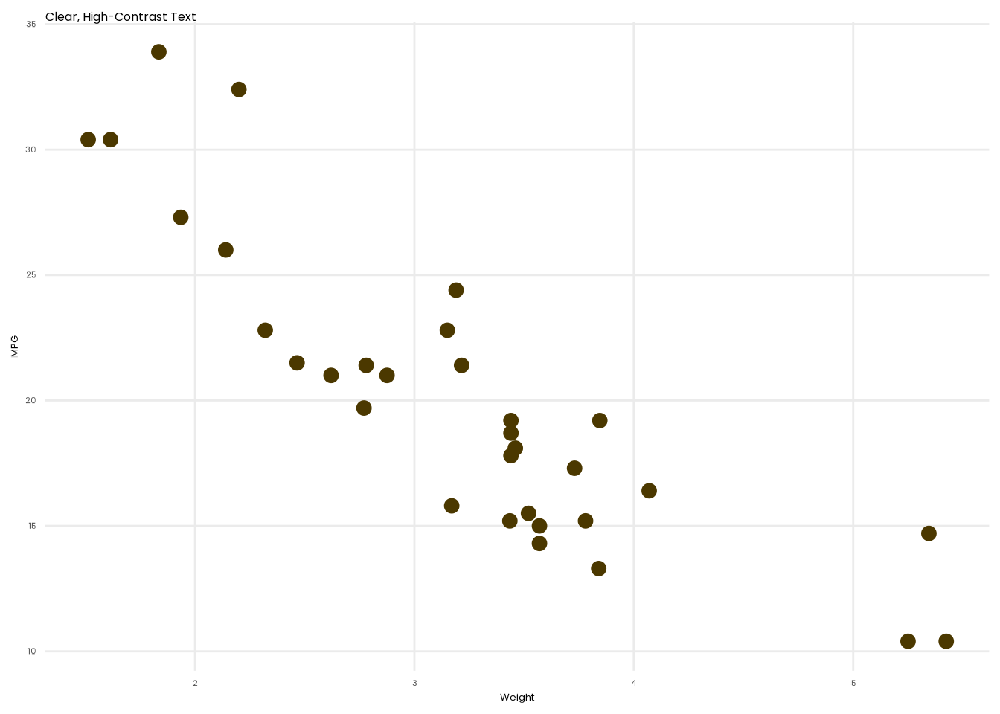

### Alt Text for Reports

When including plots in documents, always add alt text:

``` r

# In RMarkdown, use fig.alt
# ```{r, fig.alt="Scatter plot showing negative correlation between weight and MPG"}
# plot here
# ```
```

## Common Styling Patterns

### Minimal Plot

``` r

ggplot(economics, aes(x = date, y = unemploy)) +
  geom_line(color = benvi_palette("browns")[1], linewidth = 1) +
  theme_benvi() +
  theme(
    axis.title = element_blank(),
    panel.grid = element_blank(),
    plot.title = element_text(face = "bold")
  ) +
  labs(title = "US Unemployment")
```

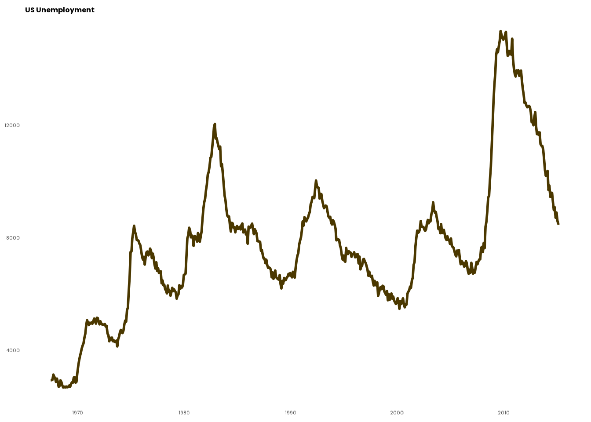

### Data-Focused (No Decorations)

``` r

ggplot(mtcars, aes(x = wt, y = mpg)) +
  geom_point(size = 3, color = benvi_palette("rio_qual")[1]) +
  theme_benvi() +
  theme(
    panel.grid = element_blank(),
    axis.line = element_line(color = "gray30"),
    axis.ticks = element_line(color = "gray30")
  )
```

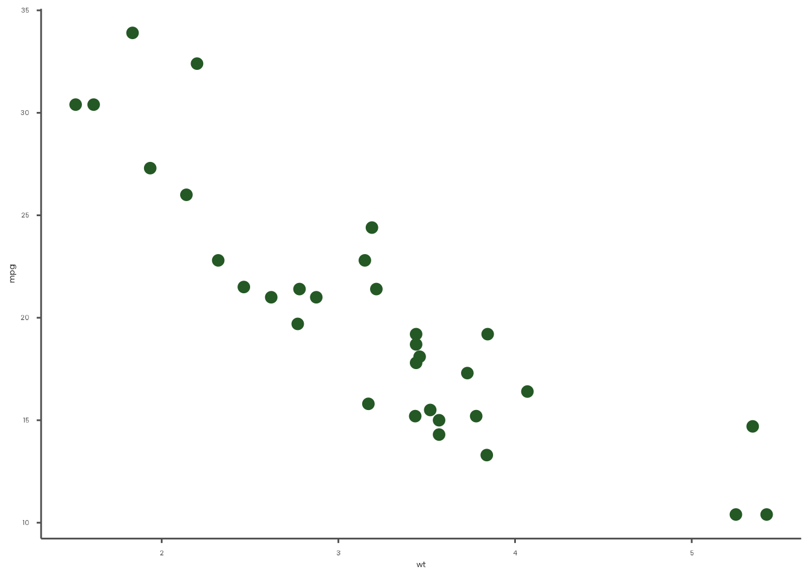

### Highlighted Plot

``` r

# Emphasize one series
mtcars_highlight <- mtcars
mtcars_highlight$highlight <- ifelse(mtcars$cyl == 6, "Six", "Other")

ggplot(mtcars_highlight, aes(x = wt, y = mpg, color = highlight)) +
  geom_point(size = 3) +
  scale_color_manual(
    values = c("Six" = benvi_palette("purples")[1], "Other" = "gray70")
  ) +
  labs(
    title = "Highlighting 6-Cylinder Vehicles",
    subtitle = "Others shown in gray",
    color = NULL
  ) +
  theme_benvi()
```

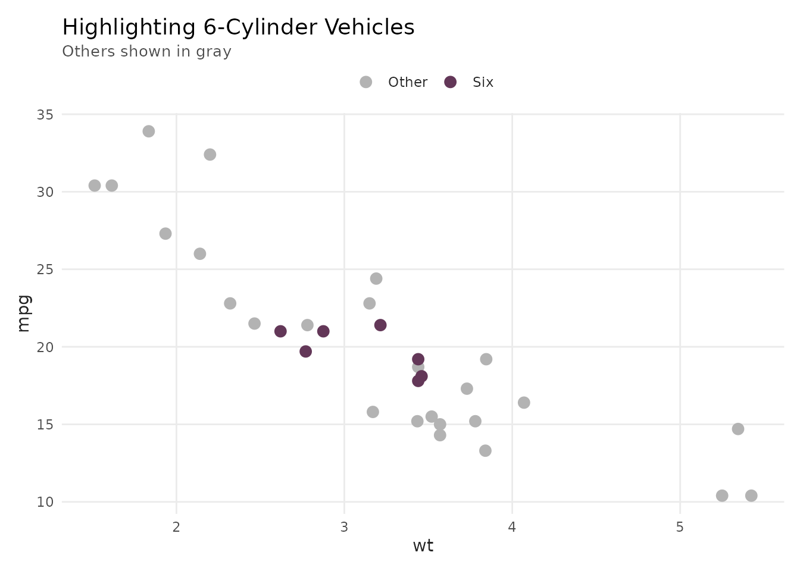

## Summary

In this vignette you learned:

- [x] How to use
  [`theme_benvi()`](https://viniciusoike.github.io/benviplot/reference/theme_benvi.md)
  for professional plots
- [x] Font management and troubleshooting
- [x] Customizing theme elements
- [x] Creating publication-ready graphics
- [x] Building custom themes
- [x] Accessibility considerations
- [x] Common styling patterns

## Best Practices Checklist

Use
[`theme_benvi()`](https://viniciusoike.github.io/benviplot/reference/theme_benvi.md)
for consistency

Always label axes with units

Add informative titles and subtitles

Include data sources in captions

Choose appropriate palettes

Ensure sufficient contrast

Test in grayscale (for print)

Keep legends clear and concise

Remove unnecessary elements

Consider your audience (presentation vs. report)

## Next Steps

- Review
  [`vignette("color-palettes")`](https://viniciusoike.github.io/benviplot/articles/color-palettes.md)
  for palette selection
- See
  [`vignette("plot-functions")`](https://viniciusoike.github.io/benviplot/articles/plot-functions.md)
  for helper functions
- Explore
  [`?theme_benvi`](https://viniciusoike.github.io/benviplot/reference/theme_benvi.md)
  for full documentation

## Further Reading

- [ggplot2 Theme
  Elements](https://ggplot2.tidyverse.org/reference/theme.html)
- [R Graphics Cookbook](https://r-graphics.org/)
- [Data Visualization Best
  Practices](https://www.storytellingwithdata.com/)
