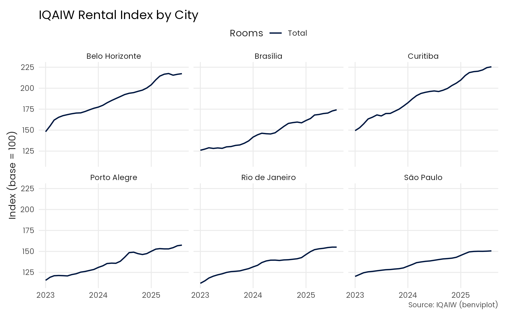
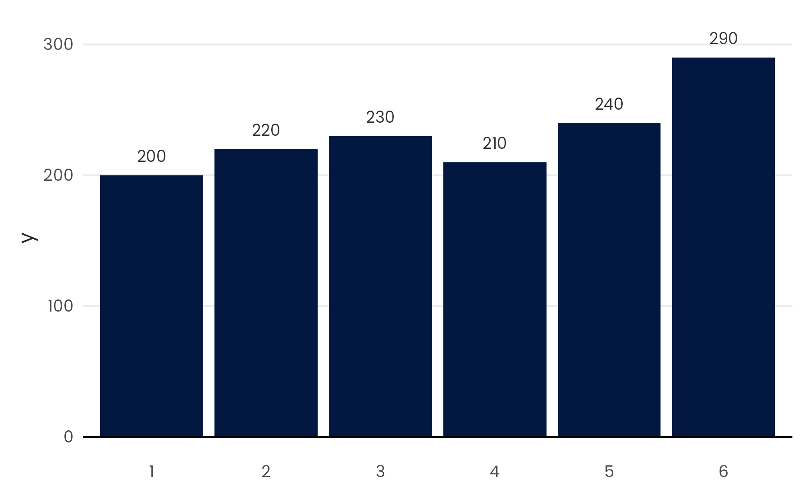

# benviplot 

## Overview

`benviplot` provides color palettes and ggplot2 helpers for consistent
data visualizations. Its main features include the following.

- Theme, qualitative, sequential, and diverging color palettes
- Discrete and continuous scales for ggplot2
- Helper functions for common chart types
- A minimal theme with optional support for the bundled Poppins font

## Installation

`benviplot` is not on CRAN yet. Install it from R-universe.

``` r

install.packages("benviplot", repos = "https://viniciusoike.r-universe.dev")
```

Alternatively, install the development version from GitHub.

``` r

# install.packages("remotes")
remotes::install_github("viniciusoike/benviplot")
```

## Font setup

`benviplot` bundles the Poppins font family. When both `systemfonts` and
`ragg` are available, the package registers Poppins and
[`theme_benvi()`](https://viniciusoike.github.io/benviplot/reference/theme_benvi.md)
uses it by default. Otherwise, the theme uses the system sans-serif
font.

Install `ragg` to render Poppins in PNG files.

``` r

install.packages("ragg")
```

You can verify your current setup with
[`font_status()`](https://viniciusoike.github.io/benviplot/reference/font_status.md).

## Usage

Load the package along with ggplot2. The examples below also use dplyr
for data manipulation.

``` r

library(ggplot2)
library(dplyr)
library(benviplot)
```

## Color palettes

Preview a color palette with
[`benvi_palette()`](https://viniciusoike.github.io/benviplot/reference/benvi_palette.md).

``` r

benvi_palette()
```

## Plotting

Use one of the following scale functions to apply the palettes to a
plot.

- [`scale_color_benvi_d()`](https://viniciusoike.github.io/benviplot/reference/ggplot2-scales-discrete.md)
- [`scale_color_benvi_c()`](https://viniciusoike.github.io/benviplot/reference/ggplot2-scales-continuous.md)
- [`scale_fill_benvi_c()`](https://viniciusoike.github.io/benviplot/reference/ggplot2-scales-continuous.md)
- [`scale_fill_benvi_d()`](https://viniciusoike.github.io/benviplot/reference/ggplot2-scales-discrete.md)

Use
[`theme_benvi()`](https://viniciusoike.github.io/benviplot/reference/theme_benvi.md)
to apply the package theme.

``` r

# Rental price index for major cities
index_data <- iqaiw |>
  filter(
    rooms %in% c("1", "2"),
    between(date, as.Date("2023-01-01"), as.Date("2025-12-31"))
  )

ggplot(index_data, aes(date, index, color = rooms)) +
  geom_line(linewidth = 0.7) +
  facet_wrap(vars(name_muni)) +
  scale_color_benvi_d() +
  labs(
    title = "IQAIW Rental Index by City",
    x = NULL,
    y = "Index (base = 100)",
    color = "Rooms",
    caption = "Source: IQAIW (benviplot)"
  ) +
  theme_benvi()
```



When using a continuous scale the colors are interpolated.

``` r

# Year-over-year change by city over time
index_data <- iqaiw |>
  filter(
    rooms == "Total",
    between(date, as.Date("2023-01-01"), as.Date("2025-12-31"))
  )

ggplot(index_data, aes(x = date, y = name_muni, fill = acum12m * 100)) +
  geom_tile(height = 0.6, color = "gray90") +
  scale_fill_benvi_c(
    pal_name = "benvi_blue",
    name = "YoY Change (%)",
    direction = -1
  ) +
  scale_x_date(
    date_breaks = "1 year",
    date_labels = "%Y",
    expand = expansion(0)
  ) +
  labs(x = NULL, y = NULL) +
  theme_benvi() +
  theme(
    legend.title = element_text(hjust = 0.5, vjust = 0.75),
    axis.text = element_text(size = 12),
    panel.grid = element_blank()
  )
```


The `plot_*()` helpers create common charts for exploratory analysis.
For example, `plot_column(text = TRUE)` adds value labels above the
columns.

``` r

latest_sales <- subset(
  sales_report,
  name_muni == "Belo Horizonte" & date == max(date)
)

plot_column(latest_sales, x = name_zone, y = price_m2, text = TRUE)
```



For more examples, visit the [package
website](https://viniciusoike.github.io/benviplot/).

## Acknowledgments

This package uses color schemes inspired by the Benvi brand. This is an
independent project not affiliated with QuintoAndar.
