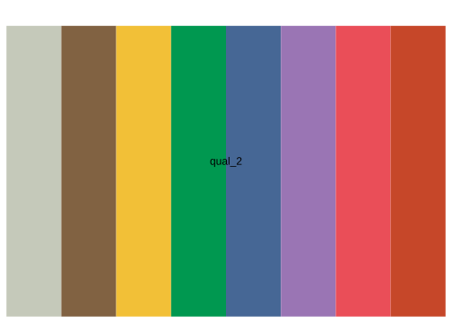
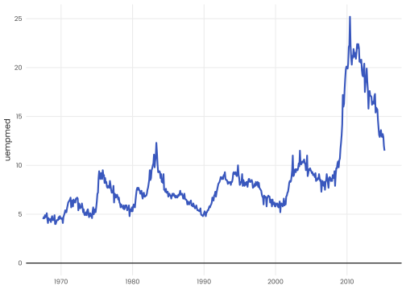
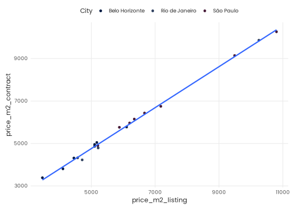
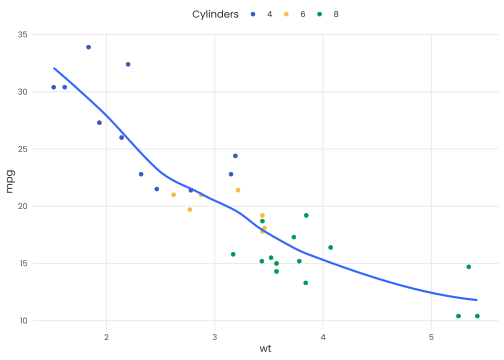

# benviplot 

> **DISCLAIMER**: This is an unofficial, independent project created by
> Vinicius Oike and is **NOT** affiliated with, endorsed by, or
> connected to QuintoAndar in any way. Benvi was a former brand of
> QuintoAndar that was discontinued in 2024. This package uses publicly
> available color schemes from that period for data visualization
> purposes. See
> [DISCLAIMER.md](https://viniciusoike.github.io/benviplot/DISCLAIMER.md)
> for details.

## Overview

`benviplot` provides color palettes and ggplot2 helpers for creating
high quality graphics. The package includes:

- **Color Palettes**: curated color schemes (Set, Qualitative,
  Sequential palettes).
- **ggplot2 Scales**: discrete and continuous scales for seamless
  ggplot2 integration.
- **Plot Helpers**: wrapper functions for common visualizations.
- **Custom Theme**: clean, professional theme with Poppins font support.

## Installation

You can install benviplot from GitHub.

``` r

# Install remotes if needed
# install.packages("remotes")

# Install benviplot from GitHub
remotes::install_github("viniciusoike/benviplot")
```

## Usage

Load the package along with ggplot2.

``` r

library(ggplot2)
library(benviplot)
```

## Color palettes

Color palettes can be visualized using `benvi_palette`. The default
palette is “qual_2”.

``` r

# Default palette (qual_2)
benvi_palette()
```


Colors follow Benvi reports guidelines that are tailored for specific
cities.

``` r

# Specify a different palette
benvi_palette("rio_qual")
```



## Plotting

To use the colors in plots use one of the `scale_*_benvi_*` functions.

- `scale_color_benvi_d`
- `scale_color_benvi_c`
- `scale_fill_benvi_c`
- `scale_fill_benvi_d`

The pacakge also supplies a generic
[`theme_benvi()`](https://viniciusoike.github.io/benviplot/reference/theme_benvi.md)
function that works best if Poppins is available.

``` r

ggplot(mtcars, aes(x = wt, y = mpg, color = as.factor(cyl))) +
  geom_point(size = 2, alpha = 0.8) +
  geom_smooth(color = benvi_palette("seq_oranges")[1], se = FALSE) +
  scale_color_benvi_d(pal_name = "qual_9", name = "Cylinders") +
  labs(
    title = "A Benvi styled plot",
    subtitle = "Fontface is defined as Poppins using showtext",
    x = "Weight (tons)",
    y = "Miles per gallon",
    caption = "Poppins font is downloaded using sysfonts::font_add_google or locally.") +
  theme_benvi()
#> `geom_smooth()` using method = 'loess' and formula = 'y ~ x'
```


When using a continuous scale the colors are interpolated.

``` r

housing <- subset(txhousing, city %in% c("Austin", "Houston", "Dallas"))

ggplot(housing, aes(x = date, y = city, fill = median / 1e3)) +
  geom_tile(height = 0.8) +
  scale_fill_benvi_c(pal_name = "greens", name = "Median House\nPrice (thous. $)") +
  scale_x_continuous(expand = expansion(0)) +
  labs(x = NULL, y = NULL) +
  theme_benvi() +
  theme(
    legend.title = element_text(hjust = 0.5, vjust = 0.75),
    axis.text = element_text(size = 12),
    panel.grid = element_blank()
    )
```


Finally, the package features some generic `plot_` functions that help
to create standard plots. These functions aim to be efficient, allowing
for quick data exploration, while remaining polished enough to be used
for reports.

``` r

plot_line(economics, x = date, y = uempmed)
```



These functions usually include simple helper arguments like `text` in
the case of `plot_column` that plots its value above the column.

``` r

sales <- data.frame(
  x = factor(c(1, 2, 3, 4, 5, 6)),
  y = c(200, 220, 230, 210, 240, 290)
)

plot_column(sales, x = x, y = y, text = TRUE)
```



The final example shows the variable argument which replaces the
`aes(fill = ...)` or `aes(color = ...)` in each function.

``` r

plot_scatter(
  mtcars, wt, mpg,
  variable = as.factor(cyl),
  fit = TRUE,
  fit_method = "auto",
  scale_name = "Cylinders")
#> `geom_smooth()` using method = 'loess' and formula = 'y ~ x'
```



## Available Palettes

The package includes several palette families:

- **Theme Palettes** (grays, browns, yellows, greens, blues, purples,
  pinks, oranges): 4-color palettes for basic visualizations
- **Qualitative Palettes** (qual_1 through qual_9): 8-color palettes for
  categorical data
- **Sequential Palettes** (seq_grays, seq_browns, etc.): 9-color
  gradients for continuous data
- **City-specific**: Special palettes for São Paulo, Rio, and Belo
  Horizonte (spo\_*, rio\_*, bhe\_\*)
- **Brand Colors**: Specialized color scales (benvi_blue, benvi_purple,
  basic)

View all available palettes by calling
[`benvi_palette()`](https://viniciusoike.github.io/benviplot/reference/benvi_palette.md)
with different palette names, or use
[`list_palettes()`](https://viniciusoike.github.io/benviplot/reference/list_palettes.md)
to see all options.

### Fonts

The package uses the **Poppins** font from Google Fonts. On first use,
the package will automatically download the font. An internet connection
is required for initial setup.

If you encounter font issues, manually import/download fonts.

``` r

# Usually works
benviplot::import_fonts()
# But, the only fail-proof option is to download and install locally
# https://fonts.google.com
```

## Getting Help

- **Documentation**: Access via `?benviplot` or visit
  <https://viniciusoike.github.io/benviplot/>
- **Issues**: Report bugs at
  <https://github.com/viniciusoike/benviplot/issues>
- **Questions**: Open a discussion on GitHub

## License

MIT License. See
[LICENSE.md](https://viniciusoike.github.io/benviplot/LICENSE.md) for
details.

## Acknowledgments

This package uses color schemes inspired by the discontinued Benvi
brand. This is an independent project not affiliated with QuintoAndar.
